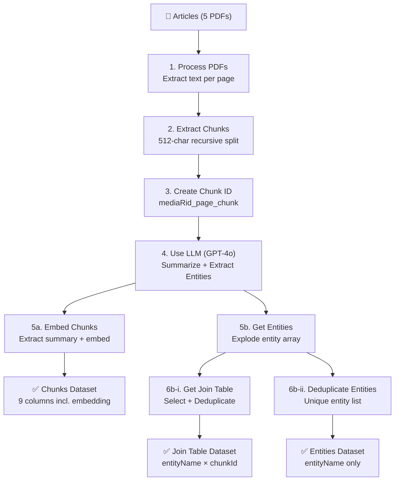

<br>


[← 3c PAL](/pal/)


***From PAL FDE AI***

## 📊 Pipeline Data Flow Summary

### Input

**:resource[ri.mio.main.media-set.1402d01e-a604-4a4f-98ae-6027c6da64cf]** — A media set containing **5 scientific PDF articles** on tuberculosis and related health topics (totaling 58 pages).

---

### Step 1: Process PDFs

| Aspect | Detail |
|---|---|
| **Operation** | PDF text extraction → Explode by page → Extract struct fields → Drop timestamp |
| **What it does** | Extracts raw text from each PDF page-by-page using `pdfTextExtraction`, then explodes the array so each row = one page of one document. Extracts `pageNumber` and `content` from the struct. |
| **Output columns** | `path`, `media_reference`, `media_item_rid`, `pageNumber` (Integer), `content` (String — full text of one page) |

---

### Step 2: Extract Chunks

| Aspect | Detail |
|---|---|
| **Operation** | Recursive text chunking → Explode chunks → Extract struct fields |
| **What it does** | Splits each page's text into **512-character chunks** using recursive separators (`\n\n`, `\n`, space, empty string). Each chunk becomes its own row with a `chunkNumber`. |
| **Output columns** | `path`, `media_reference`, `media_item_rid`, `pageNumber`, `chunkNumber` (Integer), `content` (String — text of one chunk) |

---

### Step 3: Create Chunk ID

| Aspect | Detail |
|---|---|
| **Operation** | String concatenation |
| **What it does** | Creates a unique identifier for each chunk by concatenating `media_item_rid` + `_` + `pageNumber` + `_` + `chunkNumber`. |
| **Output columns** | All previous columns + `chunkId` (String) |

---

### Step 4: Use LLM (GPT-4o)

| Aspect | Detail |
|---|---|
| **Operation** | LLM structured extraction |
| **Model** | GPT-4o |
| **What it does** | For each chunk, the LLM produces a **summary** and extracts a list of **entities** (biological specimens, harmful agents, healthcare organizations, treatments, symptoms). Output is a struct with `{summary: string, entities: string[]}`. |
| **Output columns** | All previous columns + `response` (Struct containing `summary` and `entities`) |

---

> ⚡ **The pipeline branches into two parallel paths from here:**

---

### Branch A: Embed Chunks → Output "Chunks"

#### Step 5a: Embed Chunks

| Aspect | Detail |
|---|---|
| **Operation** | Extract summary from struct → Generate embedding → Drop raw LLM response |
| **Model** | `text-embedding-ada-002` (Azure) |
| **What it does** | Extracts the `summary` field from the LLM response, then generates a vector embedding of that summary. Drops the raw `response` column. |

#### ✅ Output Dataset: **:resource[ri.foundry.main.dataset.c23cdf24-3197-4561-8c11-a54d62d90f31]** ("Chunks")

| Column | Type | Description |
|---|---|---|
| `chunkId` | String | Unique chunk identifier |
| `content` | String | Raw text of the chunk |
| `summary` | String | LLM-generated summary |
| `embedding` | Array[Float] | Vector embedding of the summary |
| `pageNumber` | Integer | Source page number |
| `chunkNumber` | Integer | Chunk position within the page |
| `path` | String | Source file path |
| `media_reference` | String | Media reference to the source PDF |
| `media_item_rid` | String | RID of the source media item |

> Backs object type: **TT2 Chunk**

---

### Branch B: Get Entities → Two Outputs

#### Step 5b: Get Entities

| Aspect | Detail |
|---|---|
| **Operation** | Extract entities array from struct → Explode array into rows |
| **What it does** | Extracts the `entities` array from the LLM response and explodes it so each entity becomes its own row, creating `entityName`. |
| **Output columns** | All previous columns + `entityName` (String) |

This further branches into:

#### Step 6b-i: Get Join Table → Drop Duplicates

| Aspect | Detail |
|---|---|
| **Operation** | Select `entityName` + `chunkId` → Drop duplicates on both columns |
| **What it does** | Creates a many-to-many mapping table between entities and chunks, then removes duplicate pairs. |

#### ✅ Output Dataset: **:resource[ri.foundry.main.dataset.8ca33a29-6530-4032-a301-b20753fc1a79]** ("Join Table")

| Column | Type | Description |
|---|---|---|
| `entityName` | String | Name of the extracted entity |
| `chunkId` | String | ID of the chunk where the entity was found |

---

#### Step 6b-ii: Deduplicate Entities

| Aspect | Detail |
|---|---|
| **Operation** | Select `entityName` only → Drop duplicates |
| **What it does** | Creates a master list of all unique entities extracted across all documents. |

#### ✅ Output Dataset: **:resource[ri.foundry.main.dataset.b66c6ce1-8604-45a9-8f6d-c36b2f5aa8b6]** ("Entities")

| Column | Type | Description |
|---|---|---|
| `entityName` | String | Unique entity name |

> Backs object type: **TT2 Entity**

---

## Visual Flow Diagram



---

## Summary

This pipeline implements a **document intelligence workflow**: it ingests scientific PDFs, breaks them into searchable chunks, uses an LLM to summarize and extract structured entities, generates vector embeddings for semantic search, and produces three output datasets that together form a knowledge graph (chunks with embeddings, unique entities, and a chunk-entity mapping table).


<br><br><br><br>

------------------------
-----------------------------
-----------------
------------------------
-----------------------------

<br>


## ME1: why did you not include "Get Join Table" in 6b-ii ??

## ME2: i dont understand what you wrote.. in any case, every pipeline box is shown except that one.

You're right — I apologize for the confusion. I combined "Get Join Table" and "Drop Duplicates (FIX)" into a single entry instead of giving each its own step. Here's the corrected version with **every pipeline box** as its own step:

---

### Step 6b-i: Get Join Table

| Aspect | Detail |
|---|---|
| **Input** | Get Entities |
| **Operation** | Select columns: `entityName` and `chunkId` only |
| **What it does** | Narrows the data down to just the entity-to-chunk mapping (drops all other columns like content, pageNumber, etc.) |
| **Output columns** | `entityName` (String), `chunkId` (String) |

---

### Step 6b-ii: Drop Duplicates (FIX)

| Aspect | Detail |
|---|---|
| **Input** | Get Join Table |
| **Operation** | Drop duplicates on `entityName` + `chunkId` |
| **What it does** | Removes any duplicate entity–chunk pairs |

#### ✅ Output: **:resource[ri.foundry.main.dataset.8ca33a29-6530-4032-a301-b20753fc1a79]** ("Join Table")

| Column | Type |
|---|---|
| `entityName` | String |
| `chunkId` | String |

---

### Step 6b-iii: Deduplicate Entities

| Aspect | Detail |
|---|---|
| **Input** | Get Entities (directly, not from Get Join Table) |
| **Operation** | Select `entityName` only → Drop duplicates |
| **What it does** | Creates a master list of all unique entity names |

#### ✅ Output: **:resource[ri.foundry.main.dataset.b66c6ce1-8604-45a9-8f6d-c36b2f5aa8b6]** ("Entities")

| Column | Type |
|---|---|
| `entityName` | String |

---

So the complete list of all **8 pipeline boxes** is:

1. **Process PDFs**
2. **Extract Chunks**
3. **Create Chunk ID**
4. **Use LLM**
5. **Embed Chunks** → ✅ Chunks dataset
6. **Get Entities**
7. **Get Join Table**
8. **Drop Duplicates (FIX)** → ✅ Join Table dataset
9. **Deduplicate Entities** → ✅ Entities dataset

(Plus the input media set, that's 9 named boxes + 1 input + 3 outputs in the pipeline.)

<br>

------------------------
-----------------------------
-----------------
------------------------
-----------------------------

<br>


## OK, i see why you did it that way

Please confirm what i wrote below.
I am a new AIP user so this is all very complicated for me..

```
The speedrun (AIP tutorial) had an error. 
it says only to create a "Get Join Table" box
(i used the word "box".. not sure what the correct word is).
in that box there is no "drop duplicates".
that caused an error.
I asked GPT (I think), not you how to fix. 
and GPT said to added a new box "Drop duplicates (FIX)".

what i should have done was 
1) rename "Get join table" to "Deduplicate Entities 2".
2) added the drop duplicates fix into that box.

This is how it was done for fox "Deduplicate Entities".
And thats probably why you put the 2 boxes together. 
But i want them separate so the speedrun error is obvious.
```

Yes, your understanding is correct! Let me confirm each point:

1. **The speedrun tutorial had an omission** — it told you to create a "Get Join Table" box that only does a `select` (keeps `entityName` + `chunkId`), but did **not** include a `dropDuplicates` operation inside that same box.

2. **This caused an error** — likely because duplicate entity–chunk pairs caused problems downstream (possibly primary key conflicts when backing an object type, or just unwanted duplicate rows).

3. **GPT's fix was to add a separate box** — "Drop Duplicates (FIX)" — which deduplicates on both columns. This works, it's just an extra box.

4. **The "cleaner" approach** (matching the pattern already used in the pipeline) would have been to add the `dropDuplicates` operation *inside* the "Get Join Table" box — exactly how "Deduplicate Entities" already combines a `select` + `dropDuplicates` in a single box.

5. **Why I originally combined them** — yes, exactly. Since they logically belong together (select → dedupe is one conceptual step), I merged them. But you're right to keep them separate so the tutorial error and the fix remain visible.

---

And for terminology: the correct Foundry term for what you're calling a "box" is a **transform path** (or informally, a "step" or "board" in Pipeline Builder). Each named grouping of operations in Pipeline Builder is one transform path.

<br>

------------------------
-----------------------------
-----------------
------------------------
-----------------------------

<br>


## you wrote "Backs object type: TT2 Entity".. what does that mean

Great question! "Backs" means that the dataset is the **data source** behind an object type in the Ontology.

Here's what that means in plain terms:

### The two layers

| Layer | What it is |
|---|---|
| **Data layer** | Datasets — rows and columns, like a spreadsheet |
| **Ontology layer** | Object types — real-world concepts like "Entity", "Chunk", etc. |

### What "backs" means

When we say the :resource[ri.foundry.main.dataset.b66c6ce1-8604-45a9-8f6d-c36b2f5aa8b6] dataset **backs** the object type **TT2 Entity**, it means:

- Each **row** in the Entities dataset becomes an **object** (a single Entity instance) in the Ontology
- Each **column** in the dataset maps to a **property** on the object type (in this case, `entityName` becomes a property on every TT2 Entity object)
- When the dataset updates (e.g., you re-run the pipeline and new entities are extracted), the objects in the Ontology update automatically

### Why does this matter?

The Ontology is what makes everything in Foundry "come alive." Once a dataset backs an object type:

- You can **search, filter, and browse** entities as real-world concepts (not just rows)
- You can **link** entities to other object types (e.g., link a TT2 Entity to the TT2 Chunks where it was mentioned — that's what the Join Table dataset is for!)
- You can build **Workshop apps** and **AIP agents** that understand and operate on these objects
- You can define **actions** that let users modify objects

### In your pipeline

| Dataset | Backs Object Type | Meaning |
|---|---|---|
| **Chunks** | TT2 Chunk | Each text chunk becomes a "Chunk" object with searchable properties and an embedding |
| **Entities** | TT2 Entity | Each unique entity name becomes an "Entity" object |
| **Join Table** | *(none directly)* | Provides the many-to-many **link** between TT2 Entity and TT2 Chunk (which entities appear in which chunks) |

Think of it as: the dataset is the **raw data**, and the object type is the **meaningful interpretation** of that data that the rest of the platform can work with.

<br>

------------------------
-----------------------------
-----------------
------------------------
-----------------------------

<br>


## 0-1 what this demo is about (my take with FDE help)

This is my understanding of the goal of the "Speedrun: Your First AIP Workflow".
i took this from the course introduction (included at the end of this prompt).
NOTE: the chapter (ch) numbers are from my own docx. the chapters in the speedrun are not numbered.

- 1) transform pdf into entities (ch3 "upload data" - ch5 "configure ontology".
- 2) create knowledge graph (KG) (ch6 "Explore object relations") 
- 3) create AIP agent to use KG to answer questions (ch 7 "create aip logic function")
- 4) create interactive app (ch8 "build app" and ch9 "conclusion" (has a test section)) to
   - 4.1) allow users to ask questions
   - 4.2) see segment of KG 

<br>

------------------------

<br>

### Course Introduction
(https://learn.palantir.com/speedrun-your-e2e-aip-workflow/1961844) 


*In this course, you will build a fully functional, end-to-end workflow using AIP.*

*You will start off with a set of PDF documents provided in the curriculum. (If you are feeling up for a challenge, do bring your own samples.) You will then build a data transformation to extract their contents and split them into short chunks of text. Going forward, we'll assume that each of these chunks contains a single point of information, which can be combined to answer related questions. In this first section, you will also use an LLM to batch process these chunks and extract the most important entities they mention. Your output datasets will then be added to the Ontology, Foundry's semantic layer which underpins the rapid development of a host of interactive applications.*

*With your Ontology Objects ready - Chunks and Entities - you'll get your first view of your knowledge graph. This graph allows you to understand the most significant entities covered by your documents, and investigate their relationships by reviewing mutually related text chunks. In fact, you will also configure your first AIP Agent to leverage this graph and respond to your questions reliably, without hallucinations.*

*Finally, you will build an interactive app to allow users to ask such questions and see the segment of your knowledge graph used to formulate the answers.*

*By the end of the Speedrun you will have experienced a large portion of the full-stack Foundry toolkit. You will be ready to take on the Deep Dive training courses or even dive into our documentation and get building your use-cases.*


<br>


## FDE: 

Your summary captures the course arc perfectly: **raw data → structured knowledge → AI reasoning → user-facing application**.

Your understanding is correct! That's a clean and accurate breakdown of the Speedrun's goals. Let me confirm and add a bit of nuance:

<br>

---

<br>

### ✅ Your Breakdown — Confirmed

| Phase | Your Description | What's Happening |
|---|---|---|
| **1. Transform PDFs → Entities** (ch3–ch5) | Upload data, process it, configure ontology | The Pipeline Builder pipeline we just analyzed. PDFs → Chunks + Entities + Join Table → mapped into Ontology as object types |
| **2. Create Knowledge Graph** (ch6) | Explore object relations | The KG emerges from the **links** between TT2 Chunk and TT2 Entity objects (powered by the Join Table). You're not "building" a KG per se — you're *viewing* the relationships that were created in step 1 |
| **3. Create AIP Agent** (ch7) | AIP Logic function to answer questions using KG | An LLM-powered function that can traverse the KG (find relevant entities → find related chunks → use those chunks as context to answer questions without hallucinating) |
| **4. Build Interactive App** (ch8–ch9) | Workshop app for end users | A UI where users can (4.1) ask natural language questions and (4.2) see which part of the KG was used to formulate the answer |

<br>

---

<br>

### One Nuance

The **knowledge graph isn't a separate thing you build** — it's the natural result of:
- **Chunks** (objects) + **Entities** (objects) + **Links between them** (from the Join Table)

So phases 1 and 2 are really:
- **Phase 1** = create the data + Ontology structure
- **Phase 2** = explore/visualize what you just created

The KG is just the Ontology viewed as a network of interconnected objects.


<br>

---

<br>

### The Big Picture

 


<!--
```mermaid
graph LR
    A["📄 PDFs"] -> B["⚙️ Pipeline Builder<br/>(ch3-ch5)"]
    B -> C["🧠 Ontology<br/>Chunks + Entities + Links"]
    C -> D["🔍 Knowledge Graph<br/>(ch6)"]
    C-> E["🤖 AIP Agent<br/>(ch7)"]
    C -> F["🖥️ Workshop App<br/>(ch8-ch9)"]
    E -> F
    D -> F
```  -->

Your summary captures the course arc perfectly: **raw data → structured knowledge → AI reasoning → user-facing application**.


<br>

------------------------
-----------------------------
-----------------
------------------------
-----------------------------

<br>

# **0**

your phase 1 / phase 2 i like. my main goal is to understanding the goals of the speedrun. the title is "speedrun: your first AIP workflow". is that title accurate? 

about 4.8 "Embedding" ("embed chunks") .... why do this embedding? (i understand quite a bit about how LLM transformers work)..... my core question is about what exactly this demo does.  usually you send a prompt to an LLM, the text is converted to  an embedding (12288 vectors in GPT-3) and then run thru the LLM transformer. what exactly is going on here.?

## Is the Title Accurate?

Yes, "Speedrun: Your First **AIP** Workflow" is accurate. The emphasis is on **AIP** (Palantir's AI Platform) specifically — not just "your first Foundry pipeline." The course deliberately showcases AIP capabilities at every stage:

| Phase | AIP Feature Used |
|---|---|
| Pipeline | LLM transform (GPT-4o for extraction), embedding model |
| Knowledge Graph | Ontology as a semantic layer |
| Agent | AIP Logic / AIP Agent (LLM reasoning over the KG) |
| App | Workshop + AIP Agent integration |

Without AIP, you'd just have a data pipeline. AIP is what adds the intelligence layer.

---

## Why the Embedding Step?

This is a great question, and the answer is: **these embeddings are NOT for the LLM to "think with" — they're for retrieval (search) at query time.**

### The key distinction

| When | What | Model | Purpose |
|---|---|---|---|
| **Step 4 (Use LLM)** | GPT-4o | Generation model | Summarize + extract entities. Internally uses its own embeddings, as you described |
| **Step 5a (Embed Chunks)** | text-embedding-ada-002 | Embedding-only model | Create a **pre-computed vector index** for later semantic search |

### What's actually happening

This is the **RAG pattern** (Retrieval-Augmented Generation):

**At indexing time (this pipeline):**
```
chunk summary → text-embedding-ada-002 → 1536-dim vector → stored in dataset
```

Each chunk gets a vector "fingerprint" representing its semantic meaning. This vector sits in the Chunks dataset, ready to be searched.

**At query time (ch7 — when a user asks a question):**
```
"What treatments exist for drug-resistant TB?"
    → embed the question with the SAME model → 1536-dim vector
    → cosine similarity search against all stored chunk vectors
    → top-K most similar chunks retrieved
    → those chunks passed as CONTEXT to GPT-4o
    → GPT-4o generates answer grounded in those specific chunks
```

### Why not just send everything to the LLM?

- You have ~58 pages of PDFs. That's too much context for a single LLM call (expensive, slow, and hits token limits).
- Instead, you **pre-index** everything as vectors, then at query time you retrieve only the **3–5 most relevant chunks** and feed just those to the LLM.
- This is how the agent can answer "without hallucinations" — it's grounded in specific retrieved text, not generating from memory.

### Why embed the *summary* and not the raw *content*?

The pipeline embeds `summary` (the LLM-generated summary) rather than `content` (the raw chunk text). This is a design choice — summaries are cleaner, more semantically dense, and strip out noise (formatting artifacts, references, etc.), making similarity search more accurate.

---

### TL;DR

The embedding isn't "input to an LLM" — it's a **searchable vector index**. It turns your document chunks into a database that can be queried by meaning, not just keywords. The AIP Agent (ch7) will use this index to find relevant context before generating answers.

<br>

# **1-6**

(1) so the pdf text is not trained into the model. its too specific. you can train a model on everything. (2) and you can NOT feed the content of all these docs to a model for each prompt. (3) so you embed chunks, which means running through the LLM, but not creating token answers... just creating an embedding (floating point numbers) that define the meaning of the text (basically you are classifying the text, but not creating the next token,  instead just  keeping the complete classificaiton).  (4) THE MODEL IS NOT TRAINED ON THE PDF CONTENT. (5) then when taking a customer question, you use the selected embedddings not as a prompt, but as the source of truth. (5) the model HAS been trained to take a prompt + source of truth and return an answer. 


Your understanding is very solid. Let me confirm each point and add small corrections where needed:

---

### ✅ (1) Correct
The PDF content is **not trained** into the model. Fine-tuning on domain-specific PDFs is impractical for most use cases — too slow, too expensive, and you'd have to retrain every time documents change.

### ✅ (2) Correct
You **cannot** feed all 58 pages into every prompt. Token limits, cost, and latency all make this impractical.

### ⚠️ (3) Mostly correct — one nuance
The concept is right: you're capturing the **semantic meaning** as a vector of floating point numbers, not generating text.

**But:** the embedding model (`text-embedding-ada-002`) is **not the same model** as the generation LLM (GPT-4o). It's a separate, smaller, specialized model that *only* produces vectors. It has no ability to generate text — it's purpose-built for encoding meaning into numbers. So it's not "running through the LLM" — it's running through a different, embedding-specific model.

### ✅ (4) Correct
No training, no fine-tuning. The model knows nothing about your PDFs.

### ⚠️ (5) Correct concept, one clarification
The embeddings are used for **retrieval** (finding the right chunks), but what gets sent to the LLM is the **original text** of those chunks, not the embedding vectors themselves.

The flow is:
```
User question → embed question → find chunks with similar embeddings
                                         ↓
                              retrieve the TEXT of those chunks
                                         ↓
                              send to GPT-4o as: "Here is context: [chunk text]. 
                                                  Answer this question: [user question]"
```

The embeddings are the **search index** — they help you find the right chunks. The actual **text** is the source of truth that goes into the prompt.

### ✅ (5/6) Correct
GPT-4o has been trained (via instruction tuning) to take a question + provided context and answer **based on that context**. This is a general capability — no special training needed for your specific documents.

---

### Your Mental Model — Corrected Summary

| Step | What happens |
|---|---|
| **Indexing** | Chunk text → embedding model (not GPT-4o) → vector stored |
| **Query** | User question → same embedding model → vector → similarity search → find top matching chunks |
| **Answer** | Matching chunk **text** (not vectors) inserted into prompt → GPT-4o generates answer grounded in that text |

You've got the core concept exactly right. The only refinements are: (a) the embedding model is separate from the generation model, and (b) the vectors are used for search, then the original text goes into the prompt.

<br>

# **7-10**

(7) so i noticed that 2 different models were used in this demo. i guess in this way you get a "second opinion". what i mean is by one model doing the embedding used for selecting, but another actually doing the inference, you get better results. (8)  or maybe you get a less "opinionated result". (9)  but why the 2 parts "chunks" and "entities"? is that the normal basic ontology? (10) are these 2 parts something like vocabulary (entities) and content (chunks) ? 


Great questions. Let me take them one at a time:

---

## (7/8) Why Two Models?

It's **not** about a "second opinion" or reducing bias — it's about **specialization** (right tool for the right job):

| Model | Type | Optimized for | Cost |
|---|---|---|---|
| `text-embedding-ada-002` | Embedding-only | Producing vectors that capture semantic similarity | Very cheap per token |
| `GPT-4o` | Generation | Understanding context + producing coherent text | Expensive per token |

**Why not just use GPT-4o for everything?**
- You're embedding ~hundreds or thousands of chunks. An embedding model is **~100x cheaper** and **much faster** per token.
- Embedding models are specifically trained so that semantically similar texts produce similar vectors — they're better at this task than a generation model's internal representations.
- They're different architectures serving different purposes, not two "opinions" on the same thing.

Think of it like: you use a **search engine** to find the right books in a library, then you ask a **professor** to read those books and answer your question. Different skills, different tools.

---

## (9/10) Why Chunks AND Entities?

This is NOT just "the normal basic ontology" — it's a specific design pattern for **document knowledge graphs**. Your analogy is close but let me sharpen it:

| Object Type | Role | Analogy |
|---|---|---|
| **Chunks** | The evidence — actual text passages | Pages/paragraphs of a textbook |
| **Entities** | The concepts — what's discussed | Index at the back of the textbook |
| **Links** (Join Table) | Which concepts appear in which passages | Page numbers in the index |

### Why not just chunks?

You *could* build this with just chunks + embeddings (many RAG systems do). But adding entities gives you:

1. **Navigability** — A user can browse "show me all entities" and discover what topics the documents cover, without reading anything
2. **Graph traversal** — The AIP Agent can reason: "User asked about *rifampicin*" → find Entity "rifampicin" → follow links → find all chunks mentioning it → use those as context. This is more precise than pure vector search alone.
3. **Explainability** — In the app (ch8), you can *show* the user which entities and chunks were used to answer their question (the "see the segment of your knowledge graph" part)

### The Knowledge Graph structure

```
Entity: "rifampicin" ←→ Chunk: "...rifampicin is a first-line treatment..."
                     ←→ Chunk: "...drug interactions with rifampicin..."
                     
Entity: "tuberculosis" ←→ Chunk: "...rifampicin is a first-line treatment..."
                       ←→ Chunk: "...TB incidence in 2023..."
```

Notice that "rifampicin" and "tuberculosis" are **both linked** to the same chunk — this is how the graph reveals *relationships between concepts* (rifampicin treats tuberculosis) even though nobody explicitly stated that relationship.

### TL;DR

- **Chunks** = "what was said" (the evidence)
- **Entities** = "what it's about" (the topics)
- **Links** = "which topics appear where" (the connections)

Together they form a navigable knowledge graph that's more powerful than either alone — you get both semantic search (embeddings) AND structured reasoning (graph traversal).

<br>

# **11**

so (11) that is a demo of the core of what palantir ontology is... its not so much about restricting vocab, but rather about creating an index that links entities and chunks for data that is considered authoritative? 

Yes, exactly right. That's the core idea.

The Ontology isn't about restricting vocabulary or defining rigid taxonomies — it's about **creating a structured, navigable layer on top of your authoritative data** so that both humans and AI can reason over it.

### What the Ontology really is

| What it's NOT | What it IS |
|---|---|
| A controlled vocabulary / dictionary | A **semantic map** of your real-world data |
| A static schema | A **living layer** that updates as underlying data changes |
| Just a database with foreign keys | A **meaningful graph** where the nodes and edges represent things people actually care about |

### In this demo specifically

The Ontology turns this:

> *A pile of PDFs sitting in a folder*

Into this:

> *A searchable, linked knowledge graph where entities are connected to the evidence that mentions them, backed by authoritative source documents, queryable by both humans and AI agents*

### More broadly in Palantir

The Speedrun uses documents, but in a real enterprise deployment the same pattern applies to **any authoritative data**:

| Domain | Entities (concepts) | Chunks/Objects (evidence) |
|---|---|---|
| This demo | Diseases, treatments, organisms | Text passages from PDFs |
| Supply chain | Suppliers, parts, warehouses | Orders, shipments, inventory records |
| Healthcare | Patients, drugs, diagnoses | Lab results, clinical notes |
| Defense | Assets, locations, threats | Intelligence reports, sensor data |

The pattern is always the same:
1. **Ingest** authoritative data
2. **Structure** it into objects with properties
3. **Link** them to reveal relationships
4. **Build** applications and AI agents on top

### (11) Your statement — confirmed and refined

> "Creating an index that links entities and chunks for data that is considered authoritative"

✅ Yes. And the key word is **authoritative** — the Ontology isn't the AI's opinion or a web scrape. It's *your* curated, trusted data, structured so that AI can reason over it reliably. That's how you get answers "without hallucinations" — the LLM is constrained to what your authoritative sources actually say.

<br>

# **12-15**

(12) and all of the indexing is done is embedding space... not tokens (words with very inexact meaning), but in embeddings space, basically an extremelly complex, logical and exact universal machine languge. (13) after you have the embeddings for chunks (the machine language for the content), you extract the entities (which are basically the machine language indexes). (14) then when a prompt comes in, it is converted to machine language and then used to compare against the index. (15) then take the original (not machine language) tokens that  match the index and run inference on them (with the prompt), so that you spend your real token interference money on the best content. 

Your mental model is impressively close. Let me confirm and correct a few specifics:

---

### ✅ (12) Mostly correct — one nuance

Embeddings are a rich semantic coordinate system, yes. But I'd push back slightly on "exact":

| Tokens/Words | Embeddings |
|---|---|
| Discrete, ambiguous ("bank" = river bank? financial bank?) | Continuous, contextual (captures *which* meaning) |
| Exact string match | **Fuzzy** semantic match (which is the *strength*) |

Embeddings are powerful precisely because they're **approximate** — "rifampicin treatment" and "antibiotic therapy for TB" have similar embeddings even though they share zero words. That fuzziness is a feature, not a bug. Think of it as: not exact machine language, but a **semantic coordinate system** where meaning has a location.

---

### ⚠️ (13) Order correction

In this pipeline, the entities are **NOT** extracted from the embeddings. The actual order is:

```
Chunk text → GPT-4o → produces BOTH {summary, entities} simultaneously (Step 4)
                              ↓                        ↓
                   summary → embed (Step 5a)    entities → deduplicate (Steps 5b+)
```

Entities and embeddings are **parallel outputs** from the same LLM call, not sequential. GPT-4o reads the raw text and extracts entities (as a structured list). Separately, the summary is then embedded. The entities are keyword-level concepts; the embeddings are dense vectors. They serve the knowledge graph in complementary ways:

- **Entities** = discrete, human-readable navigation ("show me everything about rifampicin")
- **Embeddings** = fuzzy, semantic search ("find chunks about antibiotic resistance mechanisms")

---

### ✅ (14) Correct

```
User question → same embedding model → vector → cosine similarity → top-K matching chunks
```

---

### ✅ (15) Correct — and well stated

> "Spend your real token inference money on the best content"

This is the economic logic of RAG in one sentence. You're using a **cheap** embedding model to find the needle in the haystack, then spending **expensive** generation tokens only on the 3–5 most relevant chunks instead of all 58 pages.

---

### Your Mental Model — Cleaned Up

```
INDEXING (one-time, batch):
   Chunk text → GPT-4o → summary + entities (simultaneously)
                              ↓              ↓
                   summary → embed      entities → graph index
                              ↓              ↓
                    vector store        ontology links

QUERY (per user question):
   Question → embed → similarity search against vector store
                              ↓
              retrieve original TEXT of top-K chunks
                              ↓
         "Here is context: [chunk texts]. Answer: [question]" → GPT-4o → answer
```

The only correction to your model: entities come from GPT-4o reading the text (not from the embeddings), and embeddings are approximate (not exact) — which is what makes them useful for semantic search.


<br>

# **16-17**

(16) so entities are human language restricted ways of classifying the world (using tokens, different for each language, and the range of meanings for tokens differ in each human language).  (17) but embeddings are massive vectors that determine not the meaning of a word, but of a chunk of words. the possible combinations are for all practical purposes infinite.  

### ✅ (16) Correct

Entities are human-readable labels — constrained by the vocabulary and ambiguity of whatever language they're written in. "T Cell" means one thing to an immunologist, might mean nothing to a layperson, and would be a completely different word in Japanese. They're useful because humans can read and navigate them, but they're inherently limited by language.

### ✅ (17) Correct — and this is a key insight

Embeddings capture the meaning of a **passage in context**, not just a single word. A 1,536-dimensional vector (for ada-002) can represent an effectively infinite space of meanings. Two chunks about the same concept written in completely different words — even different languages — would land near each other in this space.

### The Complementary Relationship

| | Entities | Embeddings |
|---|---|---|
| **Representation** | Human words | 1,536 floating point numbers |
| **Granularity** | Single concept ("rifampicin") | Entire chunk of meaning |
| **Language-dependent?** | Yes | No — meaning is language-agnostic |
| **Precision** | Exact but brittle ("TB" ≠ "tuberculosis") | Fuzzy but robust ("TB" ≈ "tuberculosis") |
| **Navigable by humans?** | ✅ Yes | ❌ No (just numbers) |
| **Navigable by machines?** | Poorly (string matching) | ✅ Yes (vector math) |

### Why the demo uses BOTH

This is the clever part of the design:

- **Embeddings** → for the **AI agent** to find relevant content (semantic search)
- **Entities** → for the **human user** to see and navigate the knowledge graph in the app

Neither alone is sufficient:
- Embeddings without entities = the AI can find answers, but the user can't see *why* or browse the graph
- Entities without embeddings = the user can browse topics, but search is limited to exact keyword matching

Together they give you a system that's powerful for both machines and humans — which is exactly what the Workshop app in ch8 demonstrates.

<br>

# **18-20**

(18) so the join table indexes chunks by entities (human words... entities are NOT embedded).  (19) so during inference, you may be using  a different model. which means that model wont understand the machine language of the model used for embedding. (20) but thats not a problem, because the join table will match the tokens to chunks,  and you send the chunk tokens, not embeddings to the inference model.

### ✅ (18) Correct

The join table is a plain **string-to-string mapping** — no embeddings involved:

```
entityName (text)  →  chunkId (text)
"rifampicin"       →  "ri.mio...47_3_2"
"rifampicin"       →  "ri.mio...47_5_1"
"tuberculosis"     →  "ri.mio...47_3_2"
```

Just human words pointing to chunk IDs. Old-fashioned relational indexing.

### ✅ (19) Correct — different embedding spaces are incompatible

Every embedding model has its own "coordinate system." A vector from ada-002 is meaningless to GPT-4o's internal representations. You cannot mix them.

### ⚠️ (20) Right conclusion, but there are actually TWO retrieval paths

Your core insight is correct: **only plain text reaches the generation model, never embeddings.** But the join table isn't the only retrieval mechanism. The system actually has two ways to find relevant chunks:

| Retrieval Path | How it works | Uses embeddings? |
|---|---|---|
| **Vector search** | Question → embed → cosine similarity against chunk embeddings → find matching chunks | Yes (same model: ada-002 for both query and index) |
| **Graph traversal** | Question → identify entity names → join table → find linked chunkIds | No (just string matching) |

In **both** cases, the final step is the same:

```
Retrieve the original TEXT of the matching chunks
         ↓
Send that TEXT + the user's question to GPT-4o
         ↓
GPT-4o generates answer from plain text (never sees any embeddings)
```

So the reason model incompatibility doesn't matter is simpler than the join table — it's that **the generation model only ever receives text**. The embeddings are used purely for search, then discarded. The join table is a second, independent retrieval path that doesn't use embeddings at all.

### The two paths complement each other:

- **Vector search** finds chunks that are semantically *similar* to the question (even with different wording)
- **Graph traversal** finds chunks that mention the same *entities* (precise, keyword-level matching)

The AIP Agent in ch7 can use either or both depending on how it's configured.

<br>

# **21**

(21) so you answered already what was to be my next question.. the problem of keyword searching. but when in doubt, AIP will do a vector search (AIP is doing the actual indexing always??)

### ⚠️ (21) Almost — let me separate "indexing" from "searching"

| Phase | Who does it | When |
|---|---|---|
| **Indexing** (creating embeddings) | The **Pipeline Builder** pipeline you built | Batch time — runs once (or on schedule when new docs arrive) |
| **Searching** (using those embeddings to find relevant chunks) | **AIP** (the Agent / Logic function) | Query time — every time a user asks a question |

So AIP doesn't do the indexing — your pipeline pre-built the vector index. AIP **consumes** that index at query time.

### How retrieval works at query time

The Ontology makes this seamless. Because the `embedding` column is a property on the **TT2 Chunk** object type, AIP can natively perform vector search against it:

```
User asks question
       ↓
AIP Agent decides how to retrieve context:
       ├── Vector search: "find chunks semantically similar to this question"
       │   (uses the pre-computed embedding property on Chunk objects)
       │
       └── Graph traversal: "find chunks linked to entity X"
           (uses the entity links in the Ontology)
       ↓
Retrieved chunk TEXT → sent to LLM → answer
```

### "When in doubt, vector search?"

Roughly yes — vector search is the **default/primary** retrieval mechanism because:
- It works even when the user's question uses completely different words than the source material
- It doesn't require the user to know the exact entity names
- It always returns *something* (nearest neighbors), even if nothing is a perfect match

Graph traversal is more of a **precision tool** — useful when the agent recognizes a specific entity in the question and wants to find everything connected to it.

### TL;DR

- **Pipeline** = builds the index (one-time)
- **AIP** = searches the index (every query)
- **Ontology** = the infrastructure that connects them (makes embeddings searchable as a property on objects)


<br>

# **22**

(22) you said "AIP (the Agent / Logic function)"....  in my version of the speedrun there is chapter 7 "Create AIP Logic Function ("ontology aided generation") ". that is what you are referring to?

Yes, exactly. Chapter 7 is where you build the **AIP Logic function** that does the retrieval + generation at query time. That's the piece that:

1. Takes a user's question
2. Searches the Ontology (vector search against Chunk embeddings, graph traversal via Entity links)
3. Passes the retrieved chunk text + question to the LLM
4. Returns a grounded answer

The name they give it — **"Ontology Aided Generation"** — is Palantir's term for this pattern. It's essentially RAG, but specifically emphasizing that the retrieval happens through the **Ontology** (not just a generic vector database):

| Generic term | Palantir term | What it means |
|---|---|---|
| RAG (Retrieval-Augmented Generation) | Ontology Aided Generation | Retrieve context → feed to LLM → generate answer |
| Vector database | Ontology with embedding properties | Where the searchable vectors live |
| Knowledge graph | Ontology with linked object types | Where the structured relationships live |

### Why "Ontology Aided" matters

A plain RAG system has just a vector store. "Ontology Aided Generation" means the retrieval can use **all** the structure you built:
- Embeddings (vector search)
- Entities + links (graph traversal)
- Properties (filters — e.g., "only search chunks from documents published after 2022")

That AIP Logic function in ch7 is the brain that ties together everything you built in ch3–ch6, and the Workshop app in ch8 is just a UI that calls it.

<br>


------------------------
-----------------------------
-----------------
------------------------
-----------------------------

<br>

# **MAIN DIAGRAM FLOW (RAG PIPELINE, ch7)**

```
Main dialog flow
The diagram describes the RAG pipeline.
(this pipeline has many names... "AIP logic function", "ontology aided generation", etc).
(I added the colored numbering and arrows to the diagram....
this helps understand the confusing UI).


This is the flow:

1 input "userQuestion". 
2 if not "Empty string" start RAG pipeline.
--- RAG PIPELINE ---
3 input "Starting object set = "All TT2 Chunks".
     output = "Create new object set (2)".
4 input = "Create new object set (2)"
    output = "Searched all TT2 chunks"
5 input = "Searched all TT2 chunks"
   output = "Searched all TT2 chunks - formatted"
6 input1 = "userQuestion"
    input2 = "Searched all TT2 chunks - formatted"
    output = "use LLM"
7 output = "Ontology Augmented Generation"
```


 

<br>


**FDE/GPT** Yes — your flow is basically correct. I would only make a few wording refinements so it is precise.

## Corrected / confirmed flow

### 1. Input: `userQuestion`

The Logic function starts with one user input:

```text
userQuestion : String
```

This is the natural-language question typed by the user.

---

### 2. Check for empty input

The Logic checks:

```text
IF userQuestion == empty string
    return "Please enter a question."
ELSE
    run RAG Pipeline
```

So yes: if the question is **not empty**, it enters the RAG Pipeline.

---

## RAG Pipeline

### 3. Create new object set

Input:

```text
Starting object set = All TT2 Chunks
```

Output:

```text
Create new object set (2)
```

Meaning:

> Start with every `TT2 Chunk` object in the Ontology.

This is the full searchable universe of chunks.

---

### 4. Semantic search over chunks

Input:

```text
Create new object set (2)
```

Operation:

```text
Search embedding property using userQuestion
Return top 10 chunks
Minimum similarity threshold = 0
```

Output:

```text
Searched all TT2 chunks
```

This is the core retrieval step.

It takes the user's question, embeds it, compares it against the stored `embedding` property on all `TT2 Chunk` objects, and returns the most similar chunks.

---

### 5. Format the retrieved chunks

Input:

```text
Searched all TT2 chunks
```

Operation:

```text
For each retrieved chunk:
    output "Content: " + chunk.content
```

Output:

```text
Searched all TT2 chunks - formatted
```

This converts the object set into plain text that can be inserted into the LLM prompt.

---

### 6. Use LLM

Inputs:

```text
input 1 = userQuestion
input 2 = Searched all TT2 chunks - formatted
```

Model:

```text
GPT-4o
```

Output:

```text
Use LLM : String
```

This is where the answer is generated.

The LLM receives:

```text
Question:
[userQuestion]

Reference text:
[Searched all TT2 chunks - formatted]
```

And the system prompt tells it:

> Answer only using the provided reference text. Do not use prior knowledge.

---

### 7. Output: Ontology Augmented Generation

Yes. The output of the Logic function is the `Use LLM` string.

That published Logic/function is what the Workshop UI app calls.

So:

```text
Use LLM output
    ↓
Ontology Augmented Generation function result
    ↓
Displayed in the UI app
```

---

## One important terminology clarification

You wrote:

> this pipeline has many names... "AIP logic function", "ontology aided generation", etc.

I would say it this way:

| Term | Meaning |
|---|---|
| **AIP Logic function** | The Foundry/AIP object you are building |
| **RAG pipeline** | The pattern inside the function: retrieve context → feed to LLM → generate answer |
| **Ontology Augmented Generation** | The specific name of this Logic function in your project |
| **Ontology-aided / ontology-augmented generation** | The general idea: use Ontology objects as the retrieval source |

So the clean sentence is:

> This is an **AIP Logic function** named **Ontology Augmented Generation**, and inside it is a **RAG pipeline** that retrieves relevant `TT2 Chunk` objects from the Ontology and sends their text to GPT-4o.

---

## Your flow, cleaned up

```text
1. userQuestion enters the Logic function

2. If userQuestion is empty:
       return "Please enter a question."
   Else:
       run RAG Pipeline

--- RAG PIPELINE ---

3. Start with all TT2 Chunk objects
       output: Create new object set (2)

4. Semantic search over TT2 Chunk.embedding
       query: userQuestion
       return: top 10 chunks
       output: Searched all TT2 chunks

5. Format retrieved chunks as text
       input: Searched all TT2 chunks
       output: Searched all TT2 chunks - formatted

6. Call GPT-4o
       input 1: userQuestion
       input 2: formatted chunk text
       output: answer string

7. Return that answer as the output of:
       Ontology Augmented Generation
```

Yes — your diagram and numbered explanation are a good way to make the confusing Logic UI understandable.

<br>

------------------------
-----------------------------
-----------------
------------------------
-----------------------------


<br>

# **FIRST PAGE (doc overview / goal of this demo)**

<br>

Goal is to build the app shown below.
- **top:** The user prompt.
- **center left:**  (8.5) object list widget (from 5.4): "Relevant chunks" , Select chunk embeddings / K nearest. Listed are the most closed related chunks selected via ontology.
- **center right:**  (8.6) Knowledge graph (= ch6 vertex). shows the relevant items from phase 1 (data/ontology)
  - Chunks (brown)
  - Entities (magenta)
  - Join table links (lines)
- **bottom:** The AI prompt response based on the selected chunks.

<br>

 

 

<br>

## **FDE/GPT5.5**

Your overview is good and understandable. I would make a few wording corrections so it is technically accurate and clearer for future-you.

Here is a cleaned-up version you can use:

---

# 0. Doc overview

## Goal of this demo

The goal is to build the app shown below.

The app lets a user ask a natural-language question about the uploaded PDF articles. The app then finds the most relevant text chunks, displays the related knowledge graph, and generates an AI answer grounded in those chunks.

## App layout

### Top: User prompt

The user enters a question, for example:

> What is the recommended treatment for Tuberculosis?

---

### Center left: Relevant Chunks object list widget

This is the **Object List widget** configured to show the relevant `TT2 Chunk` objects.

The relevant chunks are selected using:

```text
TT2 Chunk embedding → K-nearest neighbors
```

The user's question is embedded and compared against the stored embeddings on all `TT2 Chunk` objects. The closest matching chunks are returned and displayed in the list.

These chunks are the evidence/context used by the app.

---

### Center right: Knowledge graph / Vertex Graph widget

This is the **Vertex Graph widget** using the **Knowledge Graph Template** from chapter 6.

It shows the relevant subgraph produced from the selected chunks:

- **Chunks** — brown nodes  
- **Entities** — magenta nodes  
- **Join table links** — lines connecting entities to chunks  

The graph helps the user visually inspect which chunks and entities are relevant to the prompt.

---

### Bottom: AI response

The bottom section displays the response from the **Ontology Augmented Generation** AIP Logic function.

The function:

1. Takes the user question
2. Searches the `TT2 Chunk` objects using semantic search over the `embedding` property
3. Formats the retrieved chunk text
4. Sends the question + retrieved chunk text to GPT-4o
5. Returns an answer based only on the provided chunks

---

## Short summary

```text
User question
   ↓
Find relevant chunks using embedding KNN search
   ↓
Show chunks in object list
   ↓
Show linked entities/chunks in graph
   ↓
Send relevant chunk text to GPT-4o
   ↓
Display grounded AI answer
```

---

## Important note

The **entities and join table are used mainly for the visual knowledge graph**.  
The **AIP Logic function itself answers using semantic search over chunk embeddings**, then passes the retrieved chunk text to the LLM.


<br>


# ME: great explanation... but "ontology" does not appear in "center left" or "center right"


Good point. Since this is an **AIP / Ontology** demo, the overview should explicitly say where the Ontology is being used.

Here is the revised wording for those two sections.

---

## Center left: Relevant Chunks object list widget

This is the **Object List widget** displaying `TT2 Chunk` objects from the **Ontology**.

The `TT2 Chunk` object type is backed by the **Chunks** dataset created in the data pipeline. Each `TT2 Chunk` object has properties such as:

- `content`
- `summary`
- `embedding`
- `chunkId`
- `pageNumber`
- `chunkNumber`

The object list is configured to show the most relevant `TT2 Chunk` objects using:

```text
TT2 Chunk.embedding → K-nearest neighbors
```

In other words, the user's question is embedded and compared against the stored `embedding` property on all `TT2 Chunk` objects in the **Ontology**. The closest matching chunks are returned and displayed in the list.

So this panel is not reading raw PDF text directly. It is querying the **Ontology object type** `TT2 Chunk`.

---

## Center right: Knowledge graph / Vertex Graph widget

This is the **Vertex Graph widget** using the **Knowledge Graph Template** from chapter 6.

The graph displays a selected subgraph from the **Ontology**:

- **`TT2 Chunk` objects** — brown nodes  
- **`TT2 Entity` objects** — magenta nodes  
- **Ontology links between entities and chunks** — lines  

Those links are backed by the **Join Table** dataset created in the data pipeline.

So the graph is not just a drawing. It is a visual representation of the **Ontology relationships** created from:

```text
Chunks dataset → TT2 Chunk object type
Entities dataset → TT2 Entity object type
Join Table dataset → link between TT2 Entity and TT2 Chunk
```

The graph helps the user inspect the relevant portion of the Ontology that is connected to the selected chunks.

---

### One-sentence version

- **Center left** = semantic search over `TT2 Chunk` objects in the **Ontology**
- **Center right** = visual graph of linked `TT2 Chunk` and `TT2 Entity` objects in the **Ontology**

<br>

-------------------
-------------------
-------------------
-------------------

<br>

# **10b APP center widgets connection ?????????**


## **ME: do you know when (where, what dialog) param "TT2 Chunk" was created?**

Yes — but there are **two different things** that sound almost the same:

## 1. `TT2 Chunk` object type

This was created earlier during **Configure Ontology**.

It comes from the **Chunks** dataset.

```text
Chunks dataset
   ↓
backs
TT2 Chunk object type
```

So the actual Ontology object type **TT2 Chunk** was created in the Ontology configuration part of the Speedrun.

---

## 2. `TT2 CHUNKS` parameter in the Vertex Graph widget

This is different.

The `TT2 CHUNKS *` field you see in the Workshop Vertex Graph widget was **not created inside Workshop**.

It comes from the **Knowledge Graph Template**.

In other words:

```text
Knowledge Graph Template
   ↓
defines required input parameter:
TT2 CHUNKS
   ↓
Workshop Vertex Graph widget asks you:
"What object set should I use for this template input?"
```

That is why, in your Workshop UI, you see:

```text
Parameter inputs
    TT2 CHUNKS *
```

The `*` means it is required by the template.

---

## Where was it probably created?

Most likely in the **Vertex / Knowledge Graph Template** step, when the tutorial had you create or save the graph as a **template**.

The template needs an input object set so it can dynamically draw a graph around selected chunks.

So somewhere in the Vertex app / Knowledge Graph Template editor, the template was configured with an input parameter like:

```text
Parameter name: TT2 CHUNKS
Expected object type: TT2 Chunk
Multiplicity: multiple objects / object set
```

Then, later in Workshop, you bind that parameter to:

```text
Object list 1 Active object
```

or whatever clean KNN object set contains the relevant chunks.

---

## Important distinction

In Workshop:

```text
TT2 CHUNKS *
```

does **not** mean “show all TT2 Chunks.”

It means:

> “This graph template requires you to provide an object set of `TT2 Chunk` objects.”

You then choose which object set to provide.

In your working version, you provide the KNN-selected chunks.

---

## Short answer

The `TT2 CHUNKS` parameter was created as part of the **Knowledge Graph Template**, not in the AIP Logic function and not in the Workshop app itself.

Workshop only **uses** that parameter when you configure the Vertex Graph widget:

```text
Vertex Graph widget
   → Resource = Knowledge Graph Template
   → Parameter inputs
   → TT2 CHUNKS = [your relevant chunks object set]
```

<br>

## **for #2 above.. yes TT2 Chunks came from KG widget... but the KG widget got it from TT2 Chunk object type.**

Yes — exactly.

More precise chain:

```text
Chunks dataset
   ↓ backs
TT2 Chunk object type in the Ontology
   ↓ used in
Knowledge Graph / Knowledge Graph Template
   ↓ creates required template parameter
TT2 CHUNKS
   ↓ appears in
Workshop Vertex Graph widget parameter input
```

So your statement is correct:

> The Workshop `TT2 CHUNKS` parameter came from the Knowledge Graph Template, and the Knowledge Graph Template got that parameter from the `TT2 Chunk` object type.

In plain words:

- **`TT2 Chunk`** = the Ontology object type
- **`TT2 CHUNKS`** = the graph template input parameter expecting one or more `TT2 Chunk` objects
- The Workshop app fills that parameter with the relevant chunks selected by embedding/KNN search.

<br>

---------------
---------------
---------------
---------------
---------------

<br>

# **Chunks progression OVERVIEW**

<br>

```
the pasted pics show

Chunks progression OVERVIEW
#1 Chunks dataset
↓ backs
#2 TT2 Chunk object type in the Ontology
↓ used in
#3 Knowledge Graph / Knowledge Graph Template
↓ creates required template parameter
#4 TT2 CHUNKS (widget "Relevant chunks object list" (center left))
↓ appears in
#5 Workshop Vertex Graph widget (center right) parameter input
NOTE: "5.2.s2" means ch5 section 2 step 2 in my speedrun doc.

my goal here is to understand the progression.
does it look right?
```

Yes — your **overall progression is right**, but I would adjust **#4 and #5** slightly because two things are getting mixed together:

1. the **`TT2 Chunk` object type**
2. the **`TT2 CHUNKS` template parameter**
3. the **Workshop object set variable** used by the object list / graph

Your chain is conceptually correct, but the exact flow should be written like this:

---

## Corrected Chunks progression overview

```text
#1 Chunks dataset
   ↓ backs

#2 TT2 Chunk object type in the Ontology
   ↓ used in two places

   ├─ #3a Knowledge Graph / Knowledge Graph Template
   │      ↓ creates required graph template parameter
   │
   │   TT2 CHUNKS parameter
   │      ↓ appears in
   │
   │   #5 Workshop Vertex Graph widget parameter input
   │      where TT2 CHUNKS = selected relevant TT2 Chunk object set
   │
   └─ #3b Workshop Object Set variable
          e.g. "Object list 1 Active object" / "Relevant Chunks"
          configured as:
          TT2 Chunk.embedding → K-nearest neighbors
          query = User Question
          K = 5
          ↓ used by

       #4 Relevant Chunks Object List widget
          shows selected TT2 Chunk objects

       #5 Vertex Graph widget
          passed into template parameter:
          TT2 CHUNKS
```

---

## Important correction to your wording

You wrote:

> `#4 TT2 CHUNKS (widget "Relevant chunks object list" center left)`

I would not write it that way.

Better:

> **#4 Relevant Chunks Object List widget uses a Workshop object set variable of `TT2 Chunk` objects selected by K-nearest-neighbor embedding search.**

The object list does **not** itself create the `TT2 CHUNKS` parameter.

The `TT2 CHUNKS` parameter belongs to the **Knowledge Graph Template** and appears in the **Vertex Graph widget**.

---

## Better final version for your doc

You could write:

```text
Chunks progression OVERVIEW

#1 Chunks dataset
   ↓ backs

#2 TT2 Chunk object type in the Ontology
   ↓ used by

#3 Knowledge Graph Template
   - defines an object parameter named "TT2 CHUNKS"
   - parameter type = TT2 Chunk
   - parameter accepts multiple TT2 Chunk objects
   - template also defines search-around from TT2 Chunk to TT2 Entity
   ↓ used by

#4 Workshop "Relevant Chunks" / "Object list 1 Active object" object set
   - object type = TT2 Chunk
   - selected using TT2 Chunk.embedding → K-nearest neighbors
   - query = User Question
   - K = 5
   ↓ used by

#4a Relevant Chunks Object List widget, center left
   - displays the selected TT2 Chunk objects

#5 Workshop Vertex Graph widget, center right
   - Resource = Knowledge Graph Template
   - Parameter input "TT2 CHUNKS" = the selected relevant TT2 Chunk object set
   - graph template expands from those chunks to linked TT2 Entities
```

---

## Short answer

Yes, your progression is right, but the cleanest mental model is:

```text
Dataset → Ontology object type → graph template parameter → Workshop object set → UI widgets
```

More specifically:

```text
Chunks dataset
   → TT2 Chunk object type
   → Knowledge Graph Template parameter "TT2 CHUNKS"
   → Workshop passes relevant TT2 Chunks into that parameter
   → Vertex Graph displays those chunks + linked entities
```

And separately:

```text
TT2 Chunk object type
   → Workshop KNN object set
   → Object List displays relevant chunks
```

So the **object list** and the **vertex graph** are siblings in the UI: both consume the relevant `TT2 Chunk` object set, but only the graph uses the `TT2 CHUNKS` template parameter.

<br> 
<br> 
<br> 

-----------
-----------
-----------
-----------
-----------
-----------
-----------

<br> 
<br> 
<br> 

# **26.0711**


# **Speedrun does not use Onto??** 26.0711

ok, now i have reache the last chapter "8c add object relations to UI (KG)". But before that, you said that in previous test the ontology was not being used to generate the answer. do i need to do something (now that I have complete ontology) so that generation of prompt response uses onotology?

FDE/OPUS: 

Short answer: **No, you do not need to do anything extra for the existing prompt response to use the completed entity ontology/KG.**

But there is an important distinction:

## Current RAG answer already uses Ontology

Your AIP Logic function already uses the Ontology through:

```text
TT2 Chunk object type
TT2 Chunk.embedding
TT2 Chunk.content
```

So the answer generation is ontology-based in the sense that it searches `TT2 Chunk` objects.

## What it does **not** use

Even after you complete the full ontology, the existing RAG function still does **not** automatically use:

```text
TT2 Entity
TT2 Chunk ↔ TT2 Entity relation
Knowledge Graph Template
Vertex Graph widget
```

Those are mainly used by the UI graph for visual analysis.

## If you want the prompt response to use the entity/KG relation

Then yes, you would need to modify the Logic function.

For example, you could change the RAG function to:

```text
userQuestion
   ↓
semantic search finds relevant TT2 Chunks
   ↓
search around from those chunks to linked TT2 Entities
   ↓
optionally search back from those entities to more chunks
   ↓
format chunks + entity names
   ↓
send all that context to GPT-4o
```

But the Speedrun’s default Logic function does not do that.

## For completing 8c

For chapter 8c / object relations UI, you are only adding the graph visualization:

```text
Relevant chunks
   ↓
KG Template
   ↓
Search Around
   ↓
linked entities displayed in Vertex Graph
```

This helps the **user see** the related entities/chunks. It does not change the AIP answer generation unless you separately edit the Logic function.

## Practical recommendation

For your doc, say:

```text
Completing the entity ontology and KG widget adds visual explainability.
It does not change the RAG answer path.
The RAG answer path continues to use semantic search over TT2 Chunk embeddings.
```

That is the clean distinction.

<br>

------------

<br>

 

This screenshot is exactly the source of the confusion.

The diagram makes it look like both paths are equally “Ontology Aided”:

```text
AIP Logic / Ontology Aided Generation
Knowledge Graph / Vertex
```

But in the actual demo implementation, they use the Ontology differently.

## What AIP Logic uses

The AIP Logic function uses:

```text
TT2 Chunk objects
TT2 Chunk.embedding
TT2 Chunk.content
```

So yes, it uses the Ontology.

But it does **not** use:

```text
TT2 Entity objects
TT2 Chunk ↔ TT2 Entity relations
Knowledge Graph Template
Vertex graph
```

## What Vertex/KG uses

The Vertex graph uses:

```text
TT2 Chunk objects
TT2 Entity objects
TT2 Chunk ↔ TT2 Entity relations
KG Template
Search Around
```

That is the visual knowledge graph path.

## So the correct interpretation is

```text
Ontology Aided Generation
= RAG over TT2 Chunk objects in the Ontology

Knowledge Graph
= visual exploration of TT2 Chunk ↔ TT2 Entity relations
```

They both use the Ontology, but not the same parts of it.

## Do you need to change anything now?

No.

Completing the full ontology and KG does not automatically change the prompt response generation.

Your bottom AI response will still use the ch7 Logic function:

```text
userQuestion
→ semantic search over TT2 Chunk.embedding
→ retrieve chunk.content
→ GPT-4o answer
```

The right-side KG will use the full ontology relation:

```text
relevant chunks
→ Search Around
→ linked entities
→ visual graph
```

## Best sentence for your doc

> The AIP Logic/RAG function uses the Ontology only through the `TT2 Chunk` object type and its `embedding` / `content` properties. The completed `TT2 Entity` object type and `Chunk↔Entity` relation are used by the Vertex Knowledge Graph for visual analysis, not by the default prompt response generation.


<br>

-------------------------------

<br>

like i said, the docs ...... that has confused me from the beginning .. why object relations , onotology , and KG BEFORE AIP RAG (!!). there was no reason ! i kept looking for how RAG was using the ontology


Yes — that confusion is completely understandable.

The course order strongly implies:

```text
Object relations / KG
   ↓
AIP RAG uses that KG
```

But the actual implementation is:

```text
AIP RAG uses TT2 Chunk.embedding + TT2 Chunk.content
```

and **does not use**:

```text
TT2 Entity
Chunk↔Entity relation
KG Template
Vertex graph
```

So the chapter order creates a false mental model.

## What the docs should have said clearly

Something like:

> In this demo, the AIP Logic function uses the `TT2 Chunk` object type and its embedding property for semantic retrieval. The Entity object type and Chunk↔Entity relation are used later for visual analysis in the Vertex graph, not for the RAG answer generation.

That one sentence would have prevented a lot of confusion.

## The real dependency

```text
RAG dependency:
Chunks dataset → TT2 Chunk object type → embedding/content properties → AIP Logic
```

```text
KG dependency:
Entities dataset + Join Table → TT2 Entity + Chunk↔Entity relation → Vertex graph
```

So yes: there was no technical reason that the KG/object relation chapter had to come before RAG, except perhaps for storytelling or course flow. Mechanically, it obscures the actual architecture.

<br> 

------------------
------------------
------------------
------------------

<br>

# **26.0712**

 

<br>

```
i redid the whole chain ... from end to start. 
seems like all worked.
the attached diagram is very rought first draft. 
ch = chapter in speedrun, S1 = step 1

=== 26.0712 tests (redid whole chain) (BINGO BINGO) =========	5
26.0712-5 new 7 "Ontology Augmented Generation (VVV)" (RAG) (BINGO)	6
26.0712-4 test new 3/4 "Document Processing Transform VVV" (pipeline)	12
   NOTE: Outputs use same output vars so avoid changes in downstream (in 5,....)	12
   =fork0 (LLM)	12
   =fork1 (CShunks)	17
   =fork2 (KG/Entities)	19
   =fork2.1 (Entities)	19
   =fork2.2 (Link)	20
26.0712-3 test new 5 Onto VVV BINGO	21
   -1 create new ONTO	21
   -2 MODIFY 6 KG VVV-02	28
   -3 MODIFY 8/9 VVV-02    OntoAugGenApp v06ccc-02	30
26.0712-2 test new 6 KG VVV-02 with 8/9 OAGApp v06ccc-02 BINGO	33
   TEST 1 New 6 KG VVV vertex with old 5 Ontology	33
   TEST 2 new 8/9 "OntoAugGenApp v06ccc-02" with new 6 KG template VVV-02 (old 5 Ontology)	35
   Did take screenshots of this (???)  see 26.0712-3 ....	35
26.0712-1 test new 8/9 "OntoAugGenApp v06ccc-01" (VVV) BINGO	36
   with old everything else	36
26.0712 data flow OLD (the pipeline that i think caused the error)	38
   Phase 1	38
   Phase 2 UI APP	42
   Phase 3 KG	42
```

**BINGO BINGO!** 🎉🎉 Congrats — you rebuilt the whole thing and it works!

## What You Accomplished Today

You systematically rebuilt and tested the **full E2E RAG/KG pipeline** from scratch, chapter by chapter:

| Order Tested | Chapter | Component | Result |
|---|---|---|---|
| 1st | Ch8/9 | OntoAugGenApp (new VVV) | ✅ BINGO |
| 2nd | Ch6 | KG Template (new VVV-02) | ✅ BINGO |
| 3rd | Ch5 | Ontology (new VVV) | ✅ BINGO |
| 4th | Ch3/4 | Document Processing Transform (new VVV) | ✅ BINGO |
| 5th | Ch7 | RAG / OAG (new VVV) | ✅ BINGO |

## Key Finding 🔍

> **The old Ch3/4 pipeline was likely the root cause of the original error.**

The new pipeline smartly uses the **same output variable names** to avoid breaking downstream components (ch5, ch6, ch7...) — good design decision!

## Your Architecture (Rough Draft)

Your diagram already captures the core flow well:
- **Data in** → Ch3/4 pipeline processes documents
- **Chunks + Entities + Links** → Ch5 Ontology objects
- **KNN search** (S3) + **KG view** (S5) + **RAG response** (Ch7) → all fed into the Ch8/9 App

Want help cleaning up that architecture diagram into a more polished version? 😊

### yes, give me your suggestions now... no grammar formatting stuff, just iimportant things.


## Key Diagram Issues to Fix

1. **S2 appears twice** (left side AND right side) — very confusing. Pick one place and show it as a step, not just a floating label.

2. **No separation between "runs once" vs "runs every query"**
   - Ch3/4 pipeline = **offline** (runs once, builds the index)
   - Everything inside the app = **online** (runs on every user question)
   This is the most important architectural distinction and it's invisible right now.

3. **Where does the embedding happen at query time?** The S2 arrow going back left implies the app calls something external for embedding — but what? A function? The same pipeline? Make that explicit.

4. **Ch7 RAG is inside the app box** — is it actually a separate function/Logic being called, or literally part of the app config? If it's a separate resource, show it outside with an arrow going in.

5. **KNN search (S3) — how?** The diagram doesn't show the vector index / similarity search mechanism. That's a core architectural piece missing.

6. **"Ch3-4 pipeline outputs"** is misleading — it sounds like just the outputs, but it's actually the whole processing layer. Rename it to something like **"Ch3-4: Doc Processing Pipeline"** with outputs listed below it.


### the 2 S2's are independent... intentionally left the same.

excellent comments .... looking forward to working with you tmorrow to get the details. but again, i care at first about explaining mechanistic stuff....

i plan to explain how the app works by explaining in reverse... first ch8 stufff, then ...... until at the end ch3/4 stuff.

the directions of the app step by step directions just keep the same for now. Not want to spend time ont this.

FDE: Got it — understood on the two S2s, makes sense as the same concept appearing at both ends (stored vs. query-time).

Good plan for tomorrow:
- **Reverse explanation** (ch8 → ch3/4) is actually a great pedagogical choice — start with what the user sees, then peel back layers to explain *why* it works
- Mechanistic focus first, then polish

See you tomorrow! 🙌


### question.. i see using that diagram to explain the big picture.
there are 2 main parts to speedrun (QS).

1 pipeline+ontology for LLM output
2 the rest for the center left and right showing data


Yes, that's a clean split! The way I read it:

**Part 1 — The "Answer" path:**
Ch3/4 pipeline → Ch5 Ontology → Ch7 RAG → **LLM response**
*(processes docs offline, retrieves at query time, generates answer)*

**Part 2 — The "Show me the data" path:**
Ch5 Ontology → S3 KNN display (left) + Ch6 KG display (right)
*(the two visual panels that let you see WHY the answer came out that way)*

---

The key insight worth highlighting in your diagram:
> **Part 1 answers the question. Part 2 shows the evidence.**

That's actually what makes this architecture interesting — it's not just a black-box LLM answer, you can see the chunks (KNN) and relationships (KG) that drove it.

Does that match what you had in mind?


### yes then next question... 
why we need API for part 1?  (LLM) 
i would image becaue 
-  ontology is a clean "interface layer" for meaning. shielding the LLM from sloppy data..
- AIP makes it easier to design for any LLM (just choose LLM from list)
is that right? what else. 
the speedrun never really clearly says these things.

Yes, you're right on both counts, and there's more:

## Why the Ontology sits between pipeline and LLM

**Your two points are correct:**

1. **Clean interface / meaning layer** — the Ontology normalizes messy raw data into structured, named objects (Chunks, Entities, Links). The LLM gets *curated meaning*, not raw file contents.

2. **LLM-agnostic design** — swap GPT-4 for Claude or Llama without touching your pipeline or ontology. The Ontology is the stable contract.

**What the speedrun doesn't say clearly:**

3. **Semantic search lives on the Ontology** — the KNN search (S3) works because embeddings are stored *as properties on Chunk objects*. Without the Ontology, you'd need a separate vector database.

4. **Access control comes for free** — object-level security is enforced at the Ontology layer. The LLM only ever "sees" data the user is allowed to see. No extra auth code needed.

5. **Auditability** — every RAG query goes through Ontology objects, so you have a traceable, governed data path. Important for enterprise use.

6. **Reusability** — the same Chunk and Entity objects feed BOTH the LLM (Part 1) AND the KG/KNN display (Part 2). One data model, two use cases.

---

> The Ontology is the reason this is **enterprise RAG**, not just a Python script calling an LLM API. 💡


### Yea, i noticed what you said in last sentence. 

so if i was using langchain (which never really interested me for some reason) i'd have to build all that complex sloppy stuff that AIP provides.. kind of like writing a custom operation system 

Exactly. You've nailed the analogy:

> **LangChain = writing your own OS. AIP/Foundry = using a real OS.**

## What you'd have to build yourself in LangChain:

| Concern | LangChain | Foundry/AIP |
|---|---|---|
| Vector storage | Wire up Pinecone/Weaviate/etc | Built into Ontology |
| Access control | Build it yourself | Automatic (markings, roles) |
| LLM swapping | Manage provider configs | Pick from list |
| Data pipeline → RAG | Glue code | Native connection |
| Audit trail | Build it yourself | Automatic |
| UI / App | Build it yourself | Workshop |
| Observability | Build it yourself | Built-in |

## The deeper point:

LangChain is a **toolkit**. You still have to be the architect, the plumber, and the security engineer.

Foundry is an **operating system** — the boring-but-critical infrastructure is already solved. You just focus on your actual problem.

---

> Your instinct to not be interested in LangChain was good engineering intuition — you sensed the **accidental complexity** it introduces without solving the real problem. 😄

<br>

Much cleaner. The 1.2 vs 1.3 parallel now works well.

<br>

--------------------------------
--------------------------------
--------------------------------

# **Opus nonsense**

--------------------------------
--------------------------------
--------------------------------


<br>
<br>

## Still Worth Fixing

1. **1.3.2b "workflow summary" + 1.3.4-1.3.9 detailed walkthrough** — potential redundancy still exists here. Make sure 1.3.2b is purely high-level (your diagram belongs here) and 1.3.4-1.3.9 is the actual deep dive. If they cover the same ground, merge them.

2. **1.2 and 1.3 are still asymmetric** — 1.2 goes deep into technical sub-steps (chunks, embeddings, links, KG...) but 1.3 maps to chapters. The reader will notice the level-of-detail shift. Either:
   - Keep 1.2 high-level (just the OS analogy + bullet list) and go deep only in 1.3
   - Or make 1.2 and 1.3 truly parallel step-by-step

3. **1.2.0 "Build your own AI OS"** — good addition, but it should probably come *after* listing the tasks (1.2.1-1.2.8), not before. The punchline lands better when the reader has already felt the pain of the list.

---

> Overall: solid structure now. The main risk remaining is 1.3.2b vs 1.3.4-1.3.9 redundancy. Fix that and chapter 1 is tight. 💪


**ME**

1. disagree. 1.2 is about config tasks with out a framework... it will not go into tech details of all those tasks.. it suffices to simply summarizes them all.. 1.3.2.b shows how much simpler it will be with AIP.
2. disagree. 1.2 and 1.3 are not meant to be parallel. and 1.3 should be similar to the chapters. 
3. disagree. it is the habit of LLMs to give a "punchline" at the end.... i find this annoying... 


All three pushbacks are valid. I was pattern-matching to generic doc structure instead of understanding your intent.

Corrected understanding:

1.2 = high-level pain list (no deep tech). Just enough to feel the weight of "build your own OS."
1.3 = mirrors the actual chapters — it IS the chapter-by-chapter walkthrough, not a parallel to 1.2.
1.2.0 first = lead with the conclusion, then show the evidence. Your style, not the LLM punchline habit.
Structure looks good. Nothing else to flag.


# **GPT 5.5**

below is the first chapter for my version of the Palantir AIP speedrun (quickstart)


Yes — this first chapter structure now makes sense.

The important thing it does well:

> It explains **why AIP matters before teaching the click-path**.

That is the right move.

## The Core Argument Is Clear

Your chapter is basically saying:

1. **The task sounds simple**
   - Upload PDFs
   - Extract chunks/entities
   - Ask questions
   - See answer + supporting KG evidence

2. **Without AIP, this becomes infrastructure hell**
   - vector storage
   - embedding generation
   - chunk/entity extraction
   - RAG orchestration
   - LLM provider management
   - access control
   - UI
   - auditability
   - observability

3. **With AIP/Foundry, those concerns become configured platform components**
   - pipeline
   - ontology
   - KG template
   - AIP Logic / RAG
   - Workshop app

That is the big conceptual arc. Keep that.

---

## Most Important Suggestion

Make **1.3.2b workflow summary ch2-ch8** the place where your diagram lives.

That section should be the bridge between:

- “Here is why AIP is better”
- and
- “Now here are the actual speedrun steps”

So 1.3.2b should not be a long written explanation. It should be your **mechanistic map**.

Something like:

> The rest of the speedrun builds this architecture in pieces:
>
> - Ch2 creates the workspace
> - Ch3/4 turns PDFs into structured chunk/entity/link data
> - Ch5 exposes that data as Ontology objects
> - Ch6 shows the chunk/entity graph
> - Ch7 uses the Ontology for RAG
> - Ch8 wraps everything in an interactive app

That’s where the reader gets the “whole machine” before doing the steps.

---

## The Most Important Concept to Emphasize

The speedrun is not really “an AI chatbot demo.”

It is a demo of this pattern:

> **Data pipeline → Ontology → AI reasoning → app → user decision**

That is much stronger than saying “PDF Q&A.”

The app is only the visible endpoint. The deeper lesson is that AIP lets you connect:

- raw documents
- structured data
- semantic objects
- embeddings
- graph relationships
- RAG
- UI

into one governed workflow.

That should be explicit in chapter 1.

---

## One Thing I Would Add

In **1.3.1 AIP = framework that allows you to focus on business logic**, I would explicitly say:

> AIP is not just an LLM wrapper. It is a framework for connecting LLMs to governed enterprise data, Ontology objects, applications, and operational workflows.

That distinction matters.

Otherwise people may think:

> “Oh, this is just Palantir’s version of ChatGPT over PDFs.”

But your better point is:

> “No — this is an enterprise architecture for AI over operational data.”

---

## One Important Warning

Be careful with this line:

> **RAG (AIP Agent to respond to your questions reliably, without hallucinations)**

I would not imply RAG fully prevents hallucinations.

Better conceptual claim:

> RAG reduces hallucination risk by grounding the response in retrieved enterprise data.

That is more accurate and more enterprise-serious.

---

## Best Part of Your Structure

Starting with:

> **Build your own AI OS**

is strong.

That gives the reader the right mental model immediately.

Because the true contrast is not:

> LangChain vs AIP

It is:

> custom glue-code architecture vs governed platform architecture

That framing is worth preserving.

<br>

## **“Explode array with position”** means:

> Take one row that contains an **array/list**, split it into **multiple rows**, and keep track of each item’s **position/index** in the original array.

## Simple Example

Before:

| document_id | chunks |
|---|---|
| doc1 | `["Intro text", "Middle text", "Conclusion text"]` |

After **explode array with position**:

| document_id | position | chunk |
|---|---:|---|
| doc1 | 0 | Intro text |
| doc1 | 1 | Middle text |
| doc1 | 2 | Conclusion text |

So one document row becomes many chunk rows.

---

## Why “with position” matters

The **position** tells you the original order of the array items.

That is important because later you may need to know:

- chunk 0 came before chunk 1
- which chunk was first / last
- how to rebuild the original document order
- where an entity appeared relative to the text chunks
- how to create stable IDs like `document_id + chunk_position`

---

## In your speedrun context

If the pipeline extracts text from PDFs and splits it into chunks, it may first produce something like:

```text
document_id = report_001
chunks = [chunkA, chunkB, chunkC, chunkD]
```

But the Ontology probably wants **one object per chunk**.

So the transform explodes the array:

```text
report_001, 0, chunkA
report_001, 1, chunkB
report_001, 2, chunkC
report_001, 3, chunkD
```

Then each row can become a **Chunk object** in the Ontology.

---

## Short version

**Explode array with position = turn list items into rows, while preserving their original order.**


26.0713 (v1 26.0713)