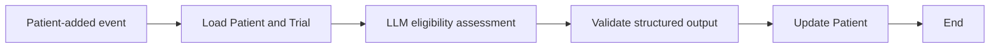

<br>


[← 3c.2 Initial PAL demos](/3c.2_pal_initial_demos/)


  - #614_pal_3_agentic_ai_qs_v03_26.0715_ss.docx 
  - https://learn.palantir.com/speedrun-your-first-agentic-aip-workflow


<!-- <br>
**See the working text for this QS in**
- **[#611vvv\_aip\_qs\_.docx](https://drive.google.com/drive/folders/1-Adawag9uA8_bq-hDF-nOuPYaRLz1eEO)**. Rewriting #611\_pal\_aip\_v06ccc-01\_ for the content of this page. Lots of my own concepts, etc.  -->

<br>
<br>
<br>

--------------------------------------------
--------------------------------------------


# **THIS PAGE LAST UPDATED MID JULY .... I AM IN PROCESS OF REWRITING IT..... (26.0829)**


--------------------------------------------
--------------------------------------------

<br>
<br>


The diagram captures the architecture well. I would make two technical clarifications:

1. With the demonstrated **Objects added to set** condition and no filters, modifying an existing Patient does **not** trigger the automation. The trigger is a new Patient entering the monitored object set. A modification would trigger it only if filters were added and the modification caused the Patient to newly enter that set.
2. The UI display is not part of the agent’s control loop; it merely presents the resulting Ontology state, possibly after a manual refresh.

A polished minimal description could be:

---

### **1.3 D3 (WIP) = “Speedrun: Your First Agentic AIP Workflow” (26.0829)**

This demo builds the first **autonomous operational agent** in this sequence. For a discussion of what “agent” means in Foundry, see the D2 notes.

The user can:

**1a.** Manually review or modify an existing Patient’s eligibility decision through a governed Action; or  
**1b.** Add a new Patient, causing that Patient to enter the object set monitored by Automate.

The agent is the complete event-driven system:

**2. Automate** observes the Ontology and supplies the recurring control loop. When a Patient enters the monitored object set, it invokes the published AIP Logic for that Patient and the configured Clinical Trial.

**3. AIP Logic** reads the Patient and Clinical Trial objects and uses an LLM to determine the eligibility decision and reasoning.

**4. A governed Action** writes the decision and reasoning back to the Patient object. Because the automation is configured to **automatically run edits**, no human is required to initiate or approve each case.

**5. The UI** displays the updated Patient state, potentially after a manual refresh.

In compact form:

```text
Patient enters monitored set
→ Automate triggers
→ AIP Logic reasons
→ Governed Action commits edits
→ Updated Patient appears in the UI
```

> **FDE:** The agent is not the LLM or AIP Logic alone. It is the complete event-driven system comprising Ontology state, Automate, AIP Logic, the LLM, and the governed Action.


<br>
<br>

--------------------------------------------
--------------------------------------------

<br>
<br>

# **2 questions** 26.0829 19:23

Q1: 

the foundry demo3 docs seem to say that the AIP logic is the agent. 
but i like your definition. 

i think its the combo of 1) automation flow, 2) AIP function, and 3) AIP logic. 

I kind of see all of foundry as one big agent. 

Q2: 

how would you compare Demo agent with 
Q2.1  typical agentic ai agent 
Q2.2 langchain/graph

<br>

## **Q1: Where is the boundary of the “agent”?**

The Demo 3 documentation appears to use **agent** as a convenient label for the AIP Logic. That is understandable at the authoring level: the Logic contains the model instructions, reads the relevant context, makes the decision, and constructs the action.

However, there are three useful boundaries.

### 1. Narrow authoring boundary: AIP Logic is the agent

```text
Patient + Clinical Trial
        ↓
AIP Logic
  ├─ reads properties
  ├─ calls the LLM
  ├─ determines eligibility
  └─ constructs an Action
```

This is probably what the documentation means. The AIP Logic contains the agent’s **decision policy**—roughly its “brain.”

By itself, however, it does not continuously monitor anything. Someone or something must invoke it, and its edits must be executed.

### 2. Operational boundary: the complete system is the agent

Your preferred definition is stronger for describing what actually runs:

```text
Ontology state
      ↓
Automate trigger
      ↓
Published AIP Logic function
      ↓
LLM reasoning
      ↓
Governed Action
      ↓
Updated Ontology state
```

At this boundary:

- **Ontology** is the agent’s observable environment and durable operational state.
- **Automate** supplies event detection and the recurring outer control loop.
- **AIP Logic** supplies the decision procedure.
- **The LLM** performs the probabilistic reasoning within that procedure.
- **The Action** supplies governed actuation.
- **Workshop/UI** allows human supervision and correction.

That is the complete **observe → reason → act** system.

### AIP Logic versus AIP function

There is one small correction to your list: the **AIP Logic and published AIP function are not two independent reasoning components**.

They are two lifecycle representations of essentially the same implementation:

```text
AIP Logic                  Published Function
(authoring definition)  →  (versioned executable release)
```

You construct the workflow in AIP Logic, then publish it as a versioned Foundry function so that Automate and other applications can invoke it.

Therefore, the three principal runtime components are more precisely:

1. **Automate**
2. **The published AIP Logic function**
3. **The governed Ontology Action**

With the Ontology serving as the stateful environment connecting them.

### 3. Platform boundary: all of Foundry as an agent

It is reasonable at a very high conceptual level to see Foundry as one large agent:

- it receives data from its environment;
- maintains a semantic model of that environment;
- runs deterministic and probabilistic reasoning;
- reacts to events;
- presents decisions to people;
- executes governed actions;
- receives updated data and repeats the cycle.

But technically, I would describe Foundry as an **agentic operating platform** rather than one agent. It can host many workflows with different goals, triggers, permissions, models, and actions. Treating all of Foundry as one agent makes it harder to identify which workflow is responsible for a particular decision.

A useful formulation is:

> **AIP Logic is the agent’s decision component; the combination of Automate, the published Logic, the Ontology, and governed Actions is the operational agent; Foundry is the environment and runtime that hosts many such agents.**

---

# Q2.1: Comparison with a typical agentic-AI agent

The Demo 3 agent is a **narrow, event-driven operational agent**. It is considerably more constrained than what is commonly marketed as a general agentic-AI agent.

## Demo 3

Its path is predetermined:

```text
New Patient
→ read fixed Patient and Trial properties
→ make one LLM call
→ return a fixed output structure
→ invoke one predefined Action
→ finish
```

The LLM determines the **contents of the decision**, but not the shape of the workflow.

It does not dynamically decide:

- which goal to pursue;
- which data sources to inspect;
- which tools to use;
- whether to invoke another model;
- whether to repeat a step;
- how to decompose a task;
- when to ask a human;
- whether its first answer needs revision.

Consequently, it has a **low degree of cognitive autonomy**, but meaningful **operational autonomy**.

## A typical tool-using agent

A more conventional agentic-AI architecture often looks like:

```text
Receive goal
→ observe current state
→ decide next step
→ choose and call a tool
→ inspect tool result
→ update working state
→ repeat until goal or stopping condition
```

It may include:

- dynamic planning;
- tool selection;
- multiple reasoning iterations;
- conditional branching;
- short- or long-term memory;
- retrieval;
- self-correction or reflection;
- delegation to subagents;
- dynamic termination;
- human approval gates.

## Comparison

| Characteristic | Demo 3 | Typical agentic-AI agent |
|---|---|---|
| Goal | Fixed: assess trial eligibility | Often supplied dynamically |
| Trigger | Ontology event | User request, event, API, or schedule |
| Workflow | Predetermined | Often dynamically selected |
| LLM calls | One fixed call | Potentially many |
| Tool selection | Fixed Action | Agent may select among tools |
| Planning | None beyond classification reasoning | Often explicit or implicit |
| Iteration | One pass per Patient | Repeats until completion |
| Memory | Ontology provides durable domain state | Working memory plus optional persistent memory |
| Action | Governed Ontology Action | APIs, databases, code, search, messages, etc. |
| Human oversight | Optional approval or later correction | Varies |
| Auditability | Strong and Ontology-centered | Depends heavily on framework |
| Autonomy | Operational but narrowly scoped | Potentially broader and more cognitive |
| Predictability | Relatively high | Usually lower |

The Demo 3 design is less flexible, but that is not necessarily a weakness. For a regulated clinical workflow, its constraints are advantages:

- predictable execution path;
- typed inputs and outputs;
- explicit permissions;
- governed edits;
- auditable actions;
- versioned logic;
- optional human approval;
- controlled failure and retry behavior.

I would call it:

> **A deterministic operational workflow containing an LLM reasoning step, made autonomous by event-driven execution.**

It is “agentic,” but it is not a general-purpose planning agent.

---

# Q2.2: Comparison with LangChain and LangGraph

## LangChain

LangChain is primarily a collection of components for constructing LLM applications:

- prompts;
- model wrappers;
- retrievers;
- tools;
- output parsers;
- chains;
- agent executors.

You could implement the core of the Demo 3 Logic as a LangChain chain:

```text
Load Patient and Trial
→ construct prompt
→ invoke model
→ parse structured result
→ call update tool
```

However, you would normally need to provide or integrate several surrounding capabilities yourself:

- database or application state;
- event monitoring;
- authentication and authorization;
- deployment;
- API hosting;
- tool permissions;
- transaction handling;
- audit records;
- UI;
- retries and operational monitoring.

Foundry provides these as parts of an integrated platform.

## LangGraph

LangGraph is the closer comparison because it models an application as a **stateful graph** of nodes and transitions.

The Demo 3 agent could be represented approximately as:



In LangGraph terms:

- each processing step could be a node;
- graph state would hold the Patient, Trial, decision, and reasoning;
- edges would determine what executes next;
- a tool node would perform the update;
- conditional edges could route uncertain cases to human review;
- a checkpointer could retain execution state.

Demo 3 is essentially a very simple, single-pass graph. It has no cyclic reasoning edge.

## Conceptual mapping

| Foundry Demo 3 | Rough LangChain/LangGraph equivalent |
|---|---|
| Ontology object | Domain record or typed application state |
| Ontology | Operational datastore plus semantic domain model |
| Automate condition | Event listener, webhook, queue consumer, or graph trigger |
| AIP Logic source | Chain or graph definition |
| Published AIP function | Deployed/versioned runnable |
| `Use LLM` block | Model node with structured output |
| Logic inputs | Initial graph state |
| Eligibility struct | Typed graph-state fields |
| Action Type | Governed tool or transactional command |
| Automatically run edits | Tool execution without approval interrupt |
| Stage for approval | Human-in-the-loop interrupt |
| Action permissions | Tool authorization and policy layer |
| Evaluation suite | Agent evaluation framework, roughly comparable to LangSmith evaluations |
| Automation retries | Node/task retry policy |
| Workshop | Operational application/frontend |
| Ontology history and action audit | Persistent records, traces, and audit infrastructure |

## The major difference

With LangGraph, you principally build the **agent control graph**, then assemble the infrastructure around it.

With Foundry, the control logic is embedded in an existing operational system:

```text
Data pipelines
+ semantic Ontology
+ object security
+ versioned functions
+ LLM reasoning
+ governed Actions
+ event automation
+ evaluation
+ operational UI
```

This makes Foundry more opinionated and less code-flexible, but much of the production environment is already present.

LangGraph generally gives you more freedom to create:

- loops;
- planners;
- dynamic tool routing;
- multiple agents;
- custom memory;
- arbitrary code nodes;
- unusual control-flow patterns.

Foundry gives you stronger built-in integration for:

- enterprise data;
- ontology-backed state;
- permissions;
- transactional edits;
- action governance;
- auditability;
- operational applications.

## Bottom line

```text
Demo 3:
event → one fixed reasoning step → one governed action → end

Typical LangGraph agent:
goal/event → dynamically traverse stateful graph
           → call tools
           → inspect results
           → loop or branch
           → stop, escalate, or act
```

The Demo 3 system could be represented in LangGraph, but it would be an extremely small graph. Its distinguishing feature is not sophisticated agent planning; it is the tight integration of AI reasoning with governed enterprise state and action.


<br>
<br>


--------------------------------------------
--------------------------------------------

<br>
<br>

# **"There is one small correction to your list: the AIP Logic and published AIP function are not two independent reasoning components."**

the function is just a refernence i though.. but still, its a separate UI dialog , so i pasted it anyway.
my primary goal is to help the reader understand all the dialogs.
i will add you comment, but its ok to keep the diagram the same?


FDE: 

**Yes, keep the diagram as it is.** Your diagram’s purpose is to explain the Foundry user experience and the relationships among its dialogs, not merely to present an abstract runtime architecture.

The separate **AIP Function** box is useful because readers will encounter it as a separate Foundry resource/UI:

```text
AIP Logic editor
      ↓ publish
Function Registry entry
      ↓ select
Automate effect
```

The Function Registry entry is effectively the **published, versioned reference/interface** through which other Foundry applications invoke the AIP Logic. It exposes information such as:

- function name and RID;
- published version;
- inputs;
- output type;
- containing project;
- underlying AIP Logic resource.

Thus, it is not a second reasoning stage, but it **is** a separate resource representation and an important configuration dialog.

I would keep the diagram and add a short annotation such as:

> **AIP Function:** the published, versioned interface/reference for the AIP Logic—not an additional reasoning step.

You might also adjust the arrow labels to make the lifecycle explicit:

```text
AIP Logic ──published as──▶ AIP Function
Automate ──invokes through──▶ AIP Function
AIP Function ──executes──▶ AIP Logic
```

Or, with minimal disruption to the diagram:

> The “AIP Function” and “AIP Logic” boxes show two Foundry UI/resource views of the same executable logic. The Function Registry entry is the published interface selected by Automate; the Logic editor contains its implementation.

That preserves the diagram’s value as a **map of what the user sees in Foundry**, while preventing readers from interpreting the function and Logic as two successive reasoning engines.


<br>
<br>


--------------------------------------------
--------------------------------------------

<br>
<br>


# **Yes—professional Foundry developers do substantial work in the UI.** Foundry is not a conventional “everything lives in source code” development environment.

However, they usually use a **hybrid approach**, and they do not repeatedly traverse all these dialogs during normal operation.

## What professionals commonly build in the UI

Several important Foundry resources are primarily visual or configuration-driven:

- **Ontology Manager:** object types, links, properties, and Actions
- **Automate:** triggers, effects, retries, and approval behavior
- **Workshop:** operational application interfaces
- **AIP Logic:** visual LLM and business-logic workflows
- **Pipeline Builder:** no-code/low-code data pipelines
- **Function Registry:** inspect and manage published functions
- **Evaluation suites:** test cases and evaluators
- **Schedules, permissions, and resource configuration**

Consequently, the dialogs in your diagram are real parts of professional Foundry development—not merely simplified tutorial interfaces.

## What is usually done in code

For more complex implementations, developers often use:

- Python transforms for data pipelines;
- TypeScript or Python Functions;
- OSDK applications;
- tests in code repositories;
- branches and pull requests;
- reusable libraries and shared components.

For example, a professional could replace the visual AIP Logic with a TypeScript or Python function. But they might still configure the following through Foundry UIs:

- its Ontology imports;
- the Action Type;
- the Automate trigger;
- permissions;
- the Workshop application;
- deployment and monitoring settings.

So moving the reasoning into code does not eliminate all the platform configuration.

## Why this demo feels especially complex

Demo 3 crosses almost every layer of Foundry:

```text
Source files
→ data pipeline
→ datasets
→ Ontology object types
→ Actions
→ AIP Logic
→ published Function
→ evaluation suite
→ Automate
→ Workshop UI
```

Each layer has its own resource, lifecycle, and dialog. The demo documentation focuses on the individual clicks but does not first provide a strong architectural map. That makes the process feel like a collection of unrelated screens.

Your diagram is useful precisely because it supplies the missing system-level view.

## The complexity has two sources

### 1. Genuine platform complexity

Foundry separates:

- data processing;
- semantic modeling;
- AI reasoning;
- authorization;
- transactional writeback;
- triggering;
- evaluation;
- presentation.

That is more complicated than writing a small LangGraph script, but it also provides enterprise controls that a standalone script would need to acquire separately.

For example, the Action is not merely a function call. It establishes:

- which object can be changed;
- which properties can be changed;
- what inputs are required;
- who may perform the operation;
- how the operation is audited;
- whether it is automatically executed or staged for approval.

### 2. UI and resource-model complexity

Some of the apparent complexity is indirection:

```text
AIP Logic
→ publish
→ Function Registry entry
→ select function version in Automate
```

These are not three different reasoning systems. They are the authoring, publication, and consumption views of one implementation. Nevertheless, Foundry exposes each lifecycle stage as a separate resource or dialog.

## How experienced teams manage it

Professional teams generally reduce the cognitive load by:

- dividing responsibilities among data, Ontology, application, and AI developers;
- using standard project structures and naming conventions;
- starting from templates or Marketplace installations;
- reusing object types, Actions, and functions;
- developing changes on branches;
- documenting the architecture rather than only the UI procedure;
- presenting ordinary users with a Workshop application instead of the development interfaces.

After deployment, a clinical staff member would normally see only something like:

```text
Add Patient
→ wait for assessment
→ review eligibility
→ optionally correct it
```

They would not interact with Pipeline Builder, Ontology Manager, AIP Logic, Function Registry, or Automate.

## Practical assessment

Foundry trades **local simplicity** for **integrated operational governance**.

A conventional developer might initially prefer:

```python
result = model(patient, trial)
database.update(result)
```

That appears much simpler. But a production implementation must eventually answer:

- What is the Patient schema?
- Who can read the clinical data?
- Who may change eligibility?
- How is the model version recorded?
- What triggers execution?
- What happens on failure?
- Can staff override the result?
- How are changes audited?
- How is the application deployed?
- How are model outputs evaluated?

Foundry gives each concern an explicit platform construct—which is powerful, but produces exactly the collection of resources and dialogs shown in your diagram.

So the short answer is:

> **Yes, professional Foundry developers work extensively in these UIs, usually alongside code. Your demo feels complex because it is constructing an entire governed operational AI system, not merely making an LLM call—and because Foundry exposes every layer and lifecycle stage as a separate resource.**

<br>
<br>

--------------------------------------------
--------------------------------------------

<br>
<br>
<br>


## **PAL-DEMO-3: Palantir agentic AI "speedrun" (quick start) (26.0713)**


See the working text for this QS in
- **[#614\_pal\_agentic\_ai\_qs\_.docx](https://drive.google.com/drive/folders/1-Adawag9uA8_bq-hDF-nOuPYaRLz1eEO)**.  


<br>*01* <br>


<!--   -->

<br>
<br>

----------------------------
----------------------------
----------------------------
----------------------------


<br>
<br>

# **NOTES**

<br>

### ME: in the speedrun it says 

"5.9 Summary
Large Language Models (LLMs) are inherently non-deterministic, meaning their responses can vary even when given the same input. 
"

that is false. 


FDE/GPT: 

You’re right that the statement is too categorical.

A better version would be:

> **Large Language Models (LLMs) are often non-deterministic in practice**, meaning their responses can vary even for the same input depending on model settings, sampling parameters, backend implementation, model updates, and execution environment.  
>
> Even when configured for more deterministic behavior, AI systems built on LLMs should still be rigorously evaluated for performance, reliability, and regression risk.

Why the original wording is misleading:

- LLMs are not *inherently* non-deterministic in the strict sense.
- With fixed weights, fixed input, deterministic decoding, fixed infrastructure, and no stochastic sampling, an LLM can produce deterministic outputs.
- However, many deployed LLM-powered systems are non-deterministic or only approximately deterministic because of sampling, temperature, tool use, retrieval variation, parallelism, model/version changes, or provider-side implementation details.

So the core evaluation recommendation is valid, but the explanation should be more precise.


ME: "too categorical" :)

FDE: 🙂 Fair.

“False” is more direct.

Suggested replacement:

Large Language Models (LLMs) are not inherently non-deterministic. With fixed weights, fixed inputs, deterministic decoding, and a stable execution environment, an LLM can produce deterministic outputs.

However, LLM-powered applications often exhibit non-deterministic behavior in practice due to sampling settings, model/version changes, retrieval variability, tool use, distributed serving infrastructure, or other system-level factors.

This makes it important to rigorously evaluate the performance and reliability of AI agents built on top of LLMs.

<br>

# xxxxxxxxxxxxxxxxxxxxxxxxx

Yes — exactly. In this speedrun setup, those labels come from the **imported Marketplace Workshop app’s Ontology resources**, specifically the action type and object type definitions that were installed with the marketplace package.

For this case:

- **Workshop table column labels** like `Eligibility Decision` / `Eligibility Decision Reasoning` come from the **Patient object type property display names**.
- **Action form labels** come from the **action type parameter display names**.
- The **AIP Logic action block labels** come from the **action type parameters** on `[Ttbonn] Modify Eligibility Decision`.
- The **rules mapping** connects those action parameters to the Patient object properties with matching display names.

So the same words appear in multiple places because the imported package created coordinated Ontology resources:

```text
Marketplace install
  └─ Ontology
      ├─ [Ttbonn] Patient object type
      │   ├─ property: Eligibility Decision
      │   └─ property: Eligibility Decision Reasoning
      │
      └─ [Ttbonn] Modify Eligibility Decision action type
          ├─ parameter: Eligibility Decision
          ├─ parameter: Eligibility Decision Reasoning
          └─ rule maps parameters → Patient properties
```

And yes — it’s complicated because the text is not “defined in the dialog” directly. The dialog is rendering Ontology metadata from the imported solution.

# yyyyyyyyyyyyyyyyyyy

Right — that screenshot shows where the **`[ttbonn]` prefix** is configured during the Marketplace installation.

Specifically:

- The install step is **“Step 7: Customize your…”**
- In **Outputs**
- Under **“Prefix ontology entities”**
- The prefix value is set to:

```text
ttbonn
```

Because **“Display name and API name”** is selected, Foundry applies that prefix to both:

1. **Ontology display names**, e.g.
   - `[Ttbonn] Patient`
   - `[Ttbonn] Clinical Trial`
   - `[Ttbonn] Modify Eligibility Decision`

2. **Ontology API names**, e.g.
   - `ttbonn...`

That prefixing is separate from the field labels like:

- `Eligibility Decision`
- `Eligibility Decision Reasoning`

Those field labels are still defined by the imported Ontology entities themselves — object type properties and action type parameters — but the marketplace installer is adding the `[Ttbonn]` namespace/prefix around the imported entities so multiple users can install the same speedrun package without name collisions.

# zzzzzzzzzzzzzzzzzzzzzzzz

ME: i've been trying to figure out where the "agent" in this "agent demo" is and what it does. seems like its in the "action" (red square in diagram). and all it does? just takes LLM-prompt-defined outputs from LLM and maps them to the ontology-defined outputs. thats it????

Pretty much, yes — for this speedrun, the “agentic” part appears to be **very thin**.

From the screenshot, the workflow is essentially:

```text
Inputs
  patient
  clinicalTrial
    ↓
Use LLM
  returns struct:
    eligibility_decision: String
    eligibility_reasoning: String
    ↓
Apply ontology action:
  [Ttbonn] Modify Eligibility Decision
    patient = patient
    Eligibility Decision = Use LLM.eligibility_decision
    Eligibility Decision Reasoning = Use LLM.eligibility_reasoning
    ↓
Patient object is updated
```

So the red-square block is **not really the agent reasoning step**. It is an **ontology edit/action application block**. Its job is to take outputs from the previous `Use LLM` block and pass them into the `[Ttbonn] Modify Eligibility Decision` action.

The actual “AI” part is the **Use LLM** block above it.

And the overall “agent” is probably being used loosely to mean:

1. **Receives contextual inputs**: `patient`, `clinicalTrial`
2. **Uses an LLM prompt** to decide eligibility and generate reasoning
3. **Takes an action** by writing the decision back to the Ontology
4. **Can be triggered by Automation or manually from Workshop**

But if by “agent” you mean a system that plans, chooses among tools, loops, searches, self-corrects, or dynamically decides what action to take — then no, this does not look like that.

It looks more like:

> LLM classification + explanation + writeback action

or

> Prompted decision function with ontology edit

The action block itself is just the bridge from the LLM output into the Ontology:

| Component | What it does |
|---|---|
| `Use LLM` | Reads patient/trial context and produces `eligibility_decision`, `eligibility_reasoning` |
| `[Ttbonn] Modify Eligibility Decision` action block | Writes those values to Patient fields |
| Action type | Defines the editable parameters and rules |
| Workshop app | Displays the Patient table and lets users review/run things |
| Automation | Runs the Logic function on some trigger/schedule |

So your summary is basically right:

> The “agent” takes LLM-prompt-defined outputs and maps them into ontology-defined action parameters, which update ontology properties.

That’s likely the entire demo pattern. “Agentic” here mostly means **LLM + tool/action side effect**, not autonomous multi-step agency.


# ffffffffffffffffffffffffff

ME: i think what the demo means by agent is possibly the entire ""Review Patient for Clinical Trial" block... they never really say clearly what the agent is. 

FDE/GPT: Yes — that’s probably the most charitable reading.

In this demo, **“the agent” is likely the whole Logic function**:

> `Review Patient for Clinical Trial`

That Logic function contains:

1. **Inputs**
   - `patient`
   - `clinicalTrial`

2. **LLM decision step**
   - The `Use LLM` block prompts the model to review the patient against the trial.
   - It returns structured fields:
     - `eligibility_decision`
     - `eligibility_reasoning`

3. **Action / ontology edit step**
   - The `[Ttbonn] Modify Eligibility Decision` block writes those fields back to the Patient object.

4. **Automation / app integration**
   - The function can be triggered from Workshop or by Automation.

So the demo is probably using **agent** to mean:

> An AI-enabled workflow that observes ontology context, uses an LLM to make a decision, and takes an action in the Ontology.

But you’re right: they do not seem to clearly define the boundary of the agent.

They could have said something like:

> In this speedrun, the “agent” is the `Review Patient for Clinical Trial` Logic function. It uses an LLM to evaluate a patient against a selected clinical trial, then applies an Ontology action to save the eligibility decision and reasoning back to the Patient object.

That would make the architecture much clearer. Currently, the word “agent” can be interpreted as:

| Possible interpretation | Is that what the demo shows? |
|---|---|
| The `Use LLM` block only | Partially — this is the reasoning step |
| The action block | No — this only writes values |
| The whole Logic function | Most likely |
| The automation that runs the function | Part of deployment, not the agent itself |
| A persistent autonomous assistant | No |
| A multi-tool planner/agent loop | No |

So yes: the demo calls it “agentic,” but what it actually builds is more specifically a **Logic-based LLM workflow with an ontology action side effect**.


# ggggggggggggggggggggggggg

ME: "charitable" ??? :)


🙂 Fair again.

Less polite version:

They’re calling the whole **`Review Patient for Clinical Trial` Logic function** the “agent,” but they don’t clearly define that.

And what it actually does is simple:

```text
patient + clinicalTrial
        ↓
Use LLM prompt
        ↓
structured output:
  eligibility_decision
  eligibility_reasoning
        ↓
Ontology action
        ↓
write those two values onto the Patient object
```

So yes:

> The “agent” is probably just the full Logic workflow: LLM call + ontology writeback.

Not a planner.  
Not autonomous.  
Not choosing tools.  
Not looping.  
Not really “agentic” in the stronger sense.

It’s an LLM-backed workflow/function that updates ontology fields.

26.0714 (v1 26.0713)