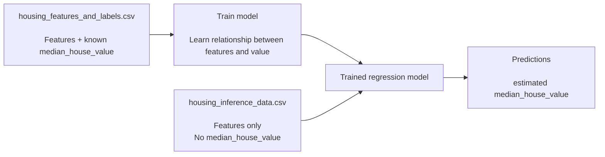
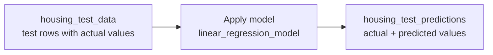

<br>

[← 3c PAL](/pal/)

<br>

## PAL DEMO D8: Model integration (26.0721)

See the working text for this QS in
- **[\#619\_.docx](https://drive.google.com/drive/folders/1-Adawag9uA8_bq-hDF-nOuPYaRLz1eEO)**.  
- **[Demo URL](https://www.palantir.com/docs/foundry/model-studio/overview/)** there are actually many ... this was a chaotic demo.  


```
TOC	
```


<!-- <br>*7-03* <br> -->

<br>

----------------------------
----------------------------
----------------------------
----------------------------

<br>
<br>

# **NOTES**

<br>

# **ME: 01 at the URL is the following tutorial text**

```
"Action: Download data
the labeled American Housing data source and upload it in the data folder as housing_features_and_labels. Download the unlabeled American Census data source and upload it to the data folder as housing_inference_data. You can upload a CSV file into Foundry by dragging it into the folder structure - for this tutorial, upload it as a structured dataset."

below are the 2 files
- file name
- columns
- sample data

i cant make sense of the data... can you?

housing_features_and_labels.csv
longitude	latitude	housing_median_age	total_rooms	total_bedrooms	population	households	median_income	median_house_value	id
-118.49	34.2	35	1109	206	515	202	5.2118	215800	8500
-118.49	34.19	23	2087	571	1809	553	3.1667	202000	8501
-118.49	34.18	31	3073	674	1486	684	4.8984	311700	8502
-118.49	34.16	37	3333	488	1171	485	6.4958	500001	8503

housing_inference_data.csv columns and rows
longitude	latitude	housing_median_age	total_rooms	total_bedrooms	population	households	median_income
-117.1168977	34.684977139164296	33.41529033324941	1107.0950571425185	206.14122690195296	515.3616070616154	200.96441266513685	4.744947497396011
-118.7941044	35.61620336	22.38140796823065	2087.2893080486674	572.6807934576076	1808.8155056894122	553.1940466869836	4.159838759559566
-118.0265845	33.75109689167518	31.62426649663079	3073.2576680241095	674.6271680285655	1483.7335280756172	685.3894404	5.456310913332794
..............................
```

<br>
<br>


FDE: Yes. The data makes sense once you separate **features** from **label/target**.

This is a simple supervised machine learning setup.

---

# What the tutorial is doing

It wants to train a model that predicts:

```text
median_house_value
```

from census/housing features such as:

```text
longitude
latitude
housing_median_age
total_rooms
population
median_income
```

So the model learns:

```text
housing features → predicted house value
```

---

# File 1: `housing_features_and_labels.csv`

This is the **training dataset**.

It has both:

## Input features

These are the columns the model uses to make a prediction:

```text
longitude
latitude
housing_median_age
total_rooms
total_bedrooms
population
households
median_income
```

## Label / target

This is the value the model is trying to learn to predict:

```text
median_house_value
```

## ID column

This is just an identifier:

```text
id
```

So one row means:

> For a census area at this longitude/latitude, with this number of rooms, bedrooms, people, households, and median income, the known median house value was X.

Example:

| longitude | latitude | median_income | median_house_value |
|---:|---:|---:|---:|
| -118.49 | 34.2 | 5.2118 | 215800 |

Meaning:

> This area had median income `5.2118`, and the known median house value was `$215,800`.

---

# File 2: `housing_inference_data.csv`

This is the **inference / prediction dataset**.

It has only the input features:

```text
longitude
latitude
housing_median_age
total_rooms
total_bedrooms
population
households
median_income
```

It does **not** have:

```text
median_house_value
```

Because that is what the model is supposed to predict.

So one row means:

> Here is a census area with known features, but unknown house value. Use the trained model to estimate the median house value.

---

# Why there are two files

```text
Training file:
features + known label
Used to train/test model

Inference file:
features only
Used to generate predictions
```

Diagram:



---

# What each column means

| Column | Meaning |
|---|---|
| `longitude` | Geographic longitude of the census area |
| `latitude` | Geographic latitude of the census area |
| `housing_median_age` | Median age of houses in the area |
| `total_rooms` | Total rooms in the area/block group |
| `total_bedrooms` | Total bedrooms in the area/block group |
| `population` | Population in the area |
| `households` | Number of households in the area |
| `median_income` | Median income in the area, usually scaled |
| `median_house_value` | **Target label**: actual median home value |
| `id` | Row identifier |

---

# Important simplification

This is not individual houses.

It is more like:

```text
one row = one geographic census district / block group
```

The model is not predicting the price of a specific house. It is predicting:

```text
median house value for an area
```

---

# In one sentence

> The first file trains a regression model using census-area features and known house values; the second file contains new census-area features where the house value is unknown and should be predicted by the trained model.


<br>
<br>
<br>

# **ME: 02 thats great info... but what i really cant understand is what the numbers represent. the units.**

<br>

Good question — the column names are misleading unless you know the original dataset.

This is based on the **California Housing** dataset from the 1990 U.S. Census. Each row is a **census block group**, not one house.

## Units / meaning of the numbers

| Column | What the number represents | Unit / scale |
|---|---|---|
| `longitude` | Geographic longitude | Decimal degrees |
| `latitude` | Geographic latitude | Decimal degrees |
| `housing_median_age` | Median age of houses in that block group | Years |
| `total_rooms` | Total number of rooms across all households in the block group | Count of rooms |
| `total_bedrooms` | Total number of bedrooms across all households in the block group | Count of bedrooms |
| `population` | Number of people living in the block group | Count of people |
| `households` | Number of households in the block group | Count of households |
| `median_income` | Median household income in the block group | Tens of thousands of USD, approximately |
| `median_house_value` | Median house value in the block group | USD |
| `id` | Row identifier | No real-world unit |

---

## Example row

```text
longitude: -118.49
latitude: 34.20
housing_median_age: 35
total_rooms: 1109
total_bedrooms: 206
population: 515
households: 202
median_income: 5.2118
median_house_value: 215800
id: 8500
```

Means:

> Census block group `8500` is located around longitude `-118.49`, latitude `34.20`.  
> The median housing age is about **35 years**.  
> Across the whole block group, there are **1,109 rooms**, **206 bedrooms**, **515 people**, and **202 households**.  
> Median income is about **5.2118 × $10,000 = $52,118**.  
> Median house value is **$215,800**.

---

## Important: not individual homes

This row does **not** mean:

```text
one house has 1109 rooms
```

It means:

```text
the whole census block group has 1109 total rooms
```

So the row is an area summary.

---

## Why inference data has decimals

Your inference file has values like:

```text
housing_median_age = 33.415
total_rooms = 1107.095
population = 515.36
```

Those are strange because counts normally should be whole numbers.

That likely means the inference data was synthetically generated or perturbed from original census rows. For modeling, decimals are acceptable because the model treats them as numeric features, but real census counts would usually be integers.

---

## One-line interpretation

> Each row describes one geographic census block group using location, housing totals, population, household count, income, and known/predicted median house value.

<br>
<br>

--------------------------------

<br>
<br>


# **FDE: Yes. That output means the dataset object was created/written, but Jupyter is just showing the Python object reference:**

```text
<foundry.transforms._dataset.Dataset at ...>
```

To view the data, do one of these.

## Option 1: Read it back in the notebook

Run:

```python
housing_test_data.read_table(format="pandas").head()
```

or:

```python
test_saved = housing_test_data.read_table(format="pandas")
test_saved
```

## Option 2: Open it in Foundry

In the left **Data** panel, click:

```text
housing_test_data
```

or click the `...` menu next to it and choose something like:

```text
Open
Open in dataset preview
```

## Option 3: Check row count

Run:

```python
housing_test_data.read_table(format="pandas").shape
```

You should see something like:

```text
(number_of_rows, number_of_columns)
```

## Why you saw that object text

This line:

```python
housing_test_data = Dataset.get("housing_test_data")
```

returns a dataset handle, not the table contents.

To see contents, use:

```python
.read_table(format="pandas")
```

<br><br>

--------------------------------------

<br><br>


Yes — this cell was successful.

Evidence:

- No error traceback appeared.
- The model pipeline was displayed.
- The final object shows:

```text
Pipeline
 ├─ SimpleImputer
 ├─ StandardScaler
 └─ LinearRegression
```

That means this ran successfully:

```python
model.fit(X_train, y_train)
```

So your linear regression model has been trained.

Small note: the step name says `"classifier"`, but the model is actually:

```python
LinearRegression()
```

So it is a regression model, not a classifier. The name is harmless, but cleaner would be:

```python
("regressor", LinearRegression())
```

But yes — training succeeded.


<br>
<br>
<br>
<br>


----------------------------------
----------------------------------
----------------------------------
----------------------------------

<br>
<br>
<br>


# **2b.6 ME: how can i test this model? using pipeline, or just some simple verification test**


You can test it **simply in the notebook first**. That is the easiest verification.

## Simple notebook test

Run this in a new cell:

```python
X_test = test_df[numeric_features]
y_test = test_df["median_house_value"]

predictions = model.predict(X_test)

predictions[:10]
```

That should show the first 10 predicted house values.

---

## Compare predictions to actual values

Run:

```python
import pandas as pd

results = test_df.copy()
results["predicted_median_house_value"] = predictions
results["error"] = results["predicted_median_house_value"] - results["median_house_value"]

results[
    [
        "median_income",
        "housing_median_age",
        "total_rooms",
        "median_house_value",
        "predicted_median_house_value",
        "error",
    ]
].head(10)
```

This gives you a simple visual check:

```text
actual value vs predicted value
```

---

## Calculate basic error metric

Run:

```python
from sklearn.metrics import mean_absolute_error, r2_score

mae = mean_absolute_error(y_test, predictions)
r2 = r2_score(y_test, predictions)

mae, r2
```

Interpretation:

- **MAE** = average prediction error in dollars.
- **R²** = how much variation the model explains.
  - closer to `1.0` is better,
  - around `0` means weak,
  - negative means bad.

---

## Quick single-row test

```python
sample = X_test.head(1)
model.predict(sample)
```

---

## Do you need a pipeline?

Not yet.

Use:

```text
Notebook test first
```

Then later:

```text
batch inference pipeline
```

if you want to apply the model to a full dataset and write predictions to Foundry.

## Minimal verification

Run this:

```python
X_test = test_df[numeric_features]
y_test = test_df["median_house_value"]

predictions = model.predict(X_test)

from sklearn.metrics import mean_absolute_error, r2_score

print("MAE:", mean_absolute_error(y_test, predictions))
print("R2:", r2_score(y_test, predictions))
print(predictions[:10])
```

<br>
<br>
<br>

--------------------------------

<br>
<br>
<br>

# **2b.7 ME: pipeline test step by step**

<br>

The simplest pipeline test is:

```text
housing_test_data → apply model → housing_test_predictions
```

You are testing whether the **published model** can take a Foundry dataset as input and produce predictions as a new dataset.

---

## Step 0 — Know what you already have

You already have:

### Input dataset

```text
housing_test_data
```

This has actual known values, including:

```text
median_house_value
```

### Published model

```text
linear_regression_model
```

Your model expects these input columns:

```text
median_income
housing_median_age
total_rooms
```

---

# Step-by-step pipeline test

## 1. Create a new Pipeline Builder pipeline

Go to your project/folder and create a new pipeline.

Name it something simple:

```text
test_model_pipeline
```

or:

```text
housing_model_inference_test
```

---

## 2. Add input dataset

Add dataset:

```text
housing_test_data
```

This is the dataset you saved from `test_df`.

---

## 3. Add model inference transform

Add a transform/node. Search for one of these terms:

```text
model
predict
inference
apply model
batch inference
```

You are looking for something like:

```text
Apply model
Run model
Model inference
Batch inference
Predict with model
```

The exact UI name may differ.

---

## 4. Select the model

In the model inference transform, select:

```text
linear_regression_model
```

If it asks for a version, choose the published version you just created.

---

## 5. Map input columns

The model only needs these columns:

```text
median_income
housing_median_age
total_rooms
```

Map them like this:

| Model input | Dataset column |
|---|---|
| `median_income` | `median_income` |
| `housing_median_age` | `housing_median_age` |
| `total_rooms` | `total_rooms` |

Do **not** feed `median_house_value` into the model. That is the actual answer used for comparison.

---

## 6. Configure output prediction column

If the transform asks for an output column name, use:

```text
predicted_median_house_value
```

If Foundry auto-generates a name like:

```text
prediction
```

that is also fine.

---

## 7. Keep useful columns

In the output, keep at least:

```text
median_income
housing_median_age
total_rooms
median_house_value
predicted_median_house_value
```

The key is to keep both:

```text
actual value = median_house_value
predicted value = predicted_median_house_value
```

---

## 8. Add output dataset

Create/write the result to a new dataset:

```text
housing_test_predictions
```

So the flow becomes:

```text
housing_test_data
        ↓
model inference using linear_regression_model
        ↓
housing_test_predictions
```

---

## 9. Preview

Preview the output.

Check:

1. It has rows.
2. It has the original columns.
3. It has a prediction column.
4. Row count should match `housing_test_data`.

Expected:

```text
housing_test_data rows = housing_test_predictions rows
```

---

## 10. Optional: add error column

If Pipeline Builder lets you add a calculated column, create:

```text
prediction_error = predicted_median_house_value - median_house_value
```

This helps compare prediction vs actual.

---

# Final expected output

Your final dataset should look conceptually like:

| median_income | housing_median_age | total_rooms | median_house_value | predicted_median_house_value | prediction_error |
|---:|---:|---:|---:|---:|---:|
| 4.8984 | 31 | 3073 | 311700 | 256476 | -55224 |
| 6.4958 | 37 | 3333 | 500001 | 337128 | -162873 |

---

# Simplest diagram



---

## If you cannot find “Apply model”

If Pipeline Builder does **not** show any model/prediction/inference transform, then the simplest test is not through Pipeline Builder. The fallback is a tiny Python transform/notebook step.

But first try searching Pipeline Builder for:

```text
model
inference
predict
```
<br> 
<br> 
<br> 

----------------------------

<br> 
<br> 
<br> 

# **is this the result?**

Yes — this is the result.

You created the output dataset:

```text
housing_test_predictions
```

It has:

```text
3.4K rows
4 columns
```

And the columns are:

```text
median_income
housing_median_age
total_rooms
prediction
```

So the pipeline successfully did:

```text
housing_test_data
        ↓
linear_regression_model
        ↓
housing_test_predictions
```

The left panel confirms the inputs:

- `housing_test_data`
- `linear_regression_model`

And it says it was updated via:

```text
housing_model_inference_test
```

So yes: this is your batch inference output.

## **One note: this output only has the model input columns plus `prediction`. If you want to compare prediction to actual value, include `median_house_value` in the pipeline output too.**


<br>


<br>

26.0721 (v1 26.0721)