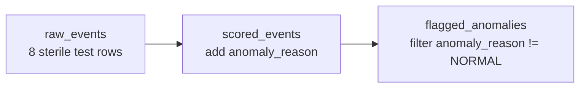

<br>

[← 3c PAL](/pal/)

<br>


# **1 Demo X**: Non-AI PAL demos

**(TODO: ask FDE for details)**.

- non-AI PAL haystack needle detection (PAL's original algorithms)
- No AI, searching for haystack needles. 
- This was how PAL started 25 years ago.
- You can do this, but you have to be very clever to get everthing just right.
- Much more data massaging and big procedural programming for needle search.
- ontology (token library)
- CPU program detection?

<br>

# **1 so palantir started out with no ai. detecting events, anomalies. could we still do such a demo? would that make sense?**

Yes. That would make a lot of sense.

A non-AI Palantir-style demo could focus on:

```text
data integration → rules/logic → anomaly detection → operational alert → investigation workflow
```

No LLMs. No ML required.

## Simple demo idea

Use sterile generated data:

```text
event_log
entity_table
threshold_rules
```

Detect:

- unusually high value,
- too many events in short time,
- missing expected event,
- state transition violation,
- duplicate IDs,
- suspicious relationship pattern.

## Minimal flow


## Why it makes sense

This captures classic Palantir value:

> connect messy operational data, detect something important, and put it into a workflow where a human can investigate and act.

That is foundational Palantir, even without AI.

<br> 

# **2 Yes. Since you chose **Pipeline Builder no-code**, do the first sterile demo like this.**

Use folder:

:resource[ri.compass.main.folder.c7b26d6a-4160-4c77-a340-7e55402c1de1]

# Demo: Rule-Based Anomaly Detection

## Goal

```text
raw_events → score events → flagged_anomalies
```

No AI. No model. No ontology yet.

---

## 1. Create a new Pipeline Builder pipeline

Name:

```text
sterile_anomaly_demo
```

Start with:

```text
Manually enter data
```

---

## 2. Create input table: `raw_events`

Columns:

| column | type |
|---|---|
| `event_id` | string |
| `entity_id` | string |
| `value` | double |
| `status` | string |
| `expected_status` | string |

Rows:

| event_id | entity_id | value | status | expected_status |
|---|---|---:|---|---|
| E001 | A | 25 | OK | OK |
| E002 | A | 140 | OK | OK |
| E003 | B | 40 | ERROR | OK |
| E004 | B | 75 | OK | OK |
| E005 | C | 200 | ERROR | OK |
| E006 | C | 10 | OK | OK |
| E007 | D | 95 | WARN | OK |
| E008 | D | 15 | OK | OK |

---

## 3. Add a transform: create anomaly reason

Add a calculated column:

```text
anomaly_reason
```

Logic:

```text
if value > 100 → HIGH_VALUE
else if status != expected_status → STATE_MISMATCH
else NORMAL
```

If Pipeline Builder has a formula/CASE expression, use:

```sql
CASE
  WHEN value > 100 THEN 'HIGH_VALUE'
  WHEN status != expected_status THEN 'STATE_MISMATCH'
  ELSE 'NORMAL'
END
```

Name this intermediate dataset/node:

```text
scored_events
```

---

## 4. Filter anomalies

Add a **Filter rows** transform:

```text
anomaly_reason != NORMAL
```

Output node:

```text
flagged_anomalies
```

Expected flagged rows:

| event_id | reason |
|---|---|
| E002 | HIGH_VALUE |
| E003 | STATE_MISMATCH |
| E005 | HIGH_VALUE |
| E007 | STATE_MISMATCH |

Expected count:

```text
4 anomalies out of 8 events
```

---

## 5. Add output datasets

Create two outputs:

```text
scored_events
flagged_anomalies
```

If you only want one output, use:

```text
flagged_anomalies
```

---

## Final pipeline diagram



## What this proves

This demo proves the classic non-AI Palantir pattern:

```text
ingest data → apply rules → identify anomalies → create operational output
```
<br>

# **3 Yes — exactly. This demo is the absolute simplest non-AI detection pattern:**

```text
fixed input dataset
   ↓
rule-based logic
   ↓
filtered output dataset
   ↓
manual inspection
```

Your summary is accurate:

- **Input**: hard-wired file/dataset `raw_events`
- **Logic**: deterministic rules
  - `value > 100`
  - `status != expected_status`
- **Output**: `flagged_anomalies`
- **Use**: manually open the output dataset to inspect results

This is not yet operational. It is just the foundational detection pipeline.

The next layers would be:

```text
manual dataset output
→ dashboard/table
→ ontology alert objects
→ Workshop app
→ Automate notification/action
```

<br>

# **4 there seems to be a problem with the built in AI/help.**
(1) you (FDE) 
(1.1) you can see pasted  screenshots (of dialogs). 
(1.2) but you dont have access to the current tool i am in.
(1.3) you seem to have been trained on really useful data and workflows. 
(2) AIP
(2.1) cant see pasted screen shots
(2.2) has access to tool i am in.
(2.3) seems to only scan the (somewhat oudated and in complete) docs for info. often not correct.


Yes — that’s a good diagnosis.

The two assistants have complementary weaknesses:

| Assistant | Strength | Weakness |
|---|---|---|
| **Me / FDE** | Can reason from screenshots, conversation history, workflows, and symptoms | I may not directly control or inspect the exact UI state unless you share it |
| **AIP Assist in product** | Knows current app/tool context and may offer UI-aware actions | Often cannot interpret screenshots you paste elsewhere and may rely heavily on docs/UI metadata |

So the best practical workflow is:

```text
Use FDE for reasoning, diagnosis, diagrams, and “what is happening?”
Use AIP Assist for “where is this exact button/control in the current app?”
```

For complicated UI, the ideal loop is:

1. Ask AIP Assist: “where is the setting for X in this current app?”
2. Screenshot the result/dialog.
3. Ask me: “what should I set here and why?”

That combines tool context with reasoning.


<br>

26.0723 (v1 26.0723)