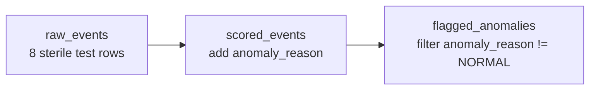

<br>

[← 3c PAL](/pal/)

<br>

### **1 DOCX TOC**

This is the TOC from the docx (**[\#620\_pal\_9\_aip-fde\_demo\_hn\_.docx](https://drive.google.com/drive/folders/1-Adawag9uA8_bq-hDF-nOuPYaRLz1eEO)**) for this DIY demo. 
- I spent quite a lot of time trying to figure how the Workshop is configured. Way too much time. 
  - FDE gave me a workflow that although worked (with several fixes). Tool a while to figure out the fix. 
  - You need to use unique names to keep things straight.
  - You also need a diagram (i will add this on 26.0803)
  - Seemed like a small bug (??) in workshop (FDE agreed with that assessment). Probably I am missing something... will have to find out for sure later.
- Finally on 26.0802 I got it right (top of TOC #7).

 

<br>

### **2 Its amazing how**

- a simple diagram,
- numbered steps, and
- variables with unique names (including step numbers)

can vastly simplify your life. The screenshot below is from the demo **[D9 UI (Workshop)](/3c.xxx_pal_HN_01_non_ai/)**. I spent almost 3 days trying to figure out how the wiring worked and how to duplicate the process (one problem was that FDE/GPT-5.5 itself made mistakes).
 

This "simple" (as simple as possible) diagram (with numbered steps) is all I needed (I have no plans to make this diagram or the numbering "perfect, polished" anytime soon; it already provides the key info required to create a basic Workshop UI and I have other priorities).
 

<br>


<!-- I spent 2 days trying to figure out how to setup Workshop. I've done it before, but it was always unclear, I could not finish without FDE help. I finally took a day (whole day) to get it clear. There were several problems:-->


### **3 For the details, see #7 in the docx** 


<br>
<br>
<br>
<br>
<br>
<br>
<br>
<br>
<br>
<br>
<br>
<br>
<br>
<br>
<br>
<br>

----------------------
----------------------
----------------------
----------------------
----------------------
----------------------
----------------------
----------------------

<br>

# **OLD NOTES**


<br>

also "the dialog DOES NOT insists on adding a "1" after"......
this time it was differenet. 
there is a bug somewhere.

Yes — that strongly suggests a UI/state bug or name-collision bug.

Likely behavior:

- If a similar variable name already exists, Workshop silently appends `1`.
- If it thinks the old name still exists/collides, it appends `1` even when confusing.
- With your clean unique name `07_filter_output_777`, there was no collision, so it did not append `1`.

So the bug is probably around **duplicate variable names / stale auto-generated names / collision handling**.

Your workaround is the right one:

```text
use numbered, unique names from the start
```

Example:

```text
07_filter_output_777
08a_filtered_anom_events_777
```

<br>

----------------------

<br>

yes you are right.... its probably a collision...
insttead of warning, it just auto-adds a 1 or seomthing... anyway, its a mess.

Yes — exactly.

Likely collision behavior:

```text
desired name exists / partially exists / stale reference exists
→ Workshop silently appends "1"
→ user thinks they are using one variable
→ app is actually wired to another
```

The safe rule:

```text
Use unique numbered names from the beginning.
Never rely on display names being exactly what you typed.
Always verify variable usage.
```

Your `777` approach is the right workaround.


<br>


----------------------


<br>


(WIP) 

#### **TOC**
- **INTRO**
- **P0 PIPELINE**
- **P1 ONTOLOGY**
- **P2 UI APP (Workshop)**
- **P3 NOTIFICATION**

**NOTES**
- Text from #620_pal_9_aip-fde_demo_hn_v05_26.0725_ss.
- ask FDE for details"
  - non-AI PAL haystack needle detection (PAL's original algorithms)
  - No AI, searching for haystack needles. 
  - This was how PAL started 25 years ago. 
  - You can do this, but you have to be very clever to get everthing just right.
  - Much more data massaging and big procedural programming for needle search.
  - ontology (token library)
  - CPU program detection?

<br>


----------------------------------------------


<br>


# **INTRO**


<br>

# **1 so palantir started out with no ai. detecting events, anomalies. could we still do such a demo? would that make sense?**

Yes. That would make a lot of sense.

A non-AI Palantir-style demo could focus on:

```text
data integration → rules/logic → anomaly detection → operational alert → investigation workflow
```

No LLMs. No ML required.

## Simple demo idea

Use sterile generated data:

```text
event_log
entity_table
threshold_rules
```

Detect:

- unusually high value,
- too many events in short time,
- missing expected event,
- state transition violation,
- duplicate IDs,
- suspicious relationship pattern.

## Minimal flow


## Why it makes sense

This captures classic Palantir value:

> connect messy operational data, detect something important, and put it into a workflow where a human can investigate and act.

That is foundational Palantir, even without AI.

<br> 

# **2 Yes. Since you chose **Pipeline Builder no-code**, do the first sterile demo like this.**

Use folder:

:resource[ri.compass.main.folder.c7b26d6a-4160-4c77-a340-7e55402c1de1]

# Demo: Rule-Based Anomaly Detection

## Goal

```text
raw_events → score events → flagged_anomalies
```

No AI. No model. No ontology yet.

---

## 1. Create a new Pipeline Builder pipeline

Name:

```text
sterile_anomaly_demo
```

Start with:

```text
Manually enter data
```

---

## 2. Create input table: `raw_events`

Columns:

| column | type |
|---|---|
| `event_id` | string |
| `entity_id` | string |
| `value` | double |
| `status` | string |
| `expected_status` | string |

Rows:

| event_id | entity_id | value | status | expected_status |
|---|---|---:|---|---|
| E001 | A | 25 | OK | OK |
| E002 | A | 140 | OK | OK |
| E003 | B | 40 | ERROR | OK |
| E004 | B | 75 | OK | OK |
| E005 | C | 200 | ERROR | OK |
| E006 | C | 10 | OK | OK |
| E007 | D | 95 | WARN | OK |
| E008 | D | 15 | OK | OK |

---

## 3. Add a transform: create anomaly reason

Add a calculated column:

```text
anomaly_reason
```

Logic:

```text
if value > 100 → HIGH_VALUE
else if status != expected_status → STATE_MISMATCH
else NORMAL
```

If Pipeline Builder has a formula/CASE expression, use:

```sql
CASE
  WHEN value > 100 THEN 'HIGH_VALUE'
  WHEN status != expected_status THEN 'STATE_MISMATCH'
  ELSE 'NORMAL'
END
```

Name this intermediate dataset/node:

```text
scored_events
```

---

## 4. Filter anomalies

Add a **Filter rows** transform:

```text
anomaly_reason != NORMAL
```

Output node:

```text
flagged_anomalies
```

Expected flagged rows:

| event_id | reason |
|---|---|
| E002 | HIGH_VALUE |
| E003 | STATE_MISMATCH |
| E005 | HIGH_VALUE |
| E007 | STATE_MISMATCH |

Expected count:

```text
4 anomalies out of 8 events
```

---

## 5. Add output datasets

Create two outputs:

```text
scored_events
flagged_anomalies
```

If you only want one output, use:

```text
flagged_anomalies
```

---

## Final pipeline diagram


```mermaid
flowchart LR
    A["raw_events<br/>8 sterile test rows"] --> B["scored_events<br/>add anomaly_reason"]

    B --> C["flagged_anomalies<br/>filter anomaly_reason != NORMAL"]
```

## What this proves

This demo proves the classic non-AI Palantir pattern:

```text
ingest data → apply rules → identify anomalies → create operational output
```
<br>

# **3 Yes — exactly. This demo is the absolute simplest non-AI detection pattern:**

```text
fixed input dataset
   ↓
rule-based logic
   ↓
filtered output dataset
   ↓
manual inspection
```

Your summary is accurate:

- **Input**: hard-wired file/dataset `raw_events`
- **Logic**: deterministic rules
  - `value > 100`
  - `status != expected_status`
- **Output**: `flagged_anomalies`
- **Use**: manually open the output dataset to inspect results

This is not yet operational. It is just the foundational detection pipeline.

The next layers would be:

```text
manual dataset output
→ dashboard/table
→ ontology alert objects
→ Workshop app
→ Automate notification/action
```


<br>

----------------------------------------------


<br>


# **P0 PIPELINE**

<br>

01 Create a local file named:
	
```text
raw_events.csv
```

Paste this content into it:

```csv
event_id,entity_id,value,status,expected_status
E001,A,25,OK,OK
E002,A,140,OK,OK
E003,B,40,ERROR,OK
E004,B,75,OK,OK
E005,C,200,ERROR,OK
E006,C,10,OK,OK
E007,D,95,WARN,OK
E008,D,15,OK,OK
```

02 Create a new project 9_demo_3
https://ziptieai.usw-17.palantirfoundry.com/workspace/builder/create-pipeline 
 
 
 
 

 
Create a new Pipeline Builder pipeline  pipeline_anomaly3

 


Then in Pipeline Builder choose:  Upload from your computer

 

 

 

 

 03 Pipeline Builder: Add Foundry data (AIP)

 
Please guide me step by step in Pipeline Builder to:
1. Add raw_events as input data.
2. Create a new column named anomaly_reason using this logic:
   - if value > 100, anomaly_reason = HIGH_VALUE
   - else if status != expected_status, anomaly_reason = STATE_MISMATCH
   - else anomaly_reason = NORMAL
3. Filter rows where anomaly_reason != NORMAL.
4. Save the filtered result as a new dataset named flagged_anomalies.
5. Verify that the output contains 4 rows: E002, E003, E005, and E007.

Please use the current Foundry UI names if possible.

 

 

 

05 After that, preview should show:

- `E002` → `HIGH_VALUE`
- `E003` → `STATE_MISMATCH`
- `E005` → `HIGH_VALUE`
- `E007` → `STATE_MISMATCH`
- all others → `NORMAL`


 
 

And the anomaly labels are right:

E001 NORMAL
E002 HIGH_VALUE
E003 STATE_MISMATCH
E004 NORMAL
E005 HIGH_VALUE
E006 NORMAL
E007 STATE_MISMATCH
E008 NORMAL
 04 Next step: add a **Filter rows** transform:

 


```text
anomaly_reason != NORMAL
```
 


Expected output after filtering:

```text
4 rows
E002
E003
E005
E007
```

 


05 Then save/materialize that output as:

```text
flagged_anomalies
```

 

 

 


 

You now have the expected output:

```text
4 rows
E002 HIGH_VALUE
E003 STATE_MISMATCH
E005 HIGH_VALUE
E007 STATE_MISMATCH
```

06 deploy/build the output dataset
The only remaining step is to deploy/build the output dataset.

 
 

 


 
 

 

 

 


 07 view output

 

You should see a Dataset Preview page with the 4 anomaly rows.


 


Understand what “run” means here

Pipeline Builder is not a live app. It creates datasets.

Flow:

```text
raw_events dataset
   ↓
pipeline logic
   ↓
flagged_anomalies dataset
```

When you deploy/build, Foundry writes the output dataset.

So the “use” is: open the output dataset and consume it downstream in analysis, Ontology, Workshop, or Automate.


so this is basic non-ai detection... very simple.....

- input is hard wired (file)
- simple logic used to select 
- output: you must manually open. 


Yes — exactly.

This demo is the absolute simplest non-AI detection pattern:

```text
fixed input dataset
   ↓
rule-based logic
   ↓
filtered output dataset
   ↓
manual inspection
```

Your summary is accurate:

- **Input**: hard-wired file/dataset `raw_events`
- **Logic**: deterministic rules
  - `value > 100`
  - `status != expected_status`
- **Output**: `flagged_anomalies`
- **Use**: manually open the output dataset to inspect results

This is not yet operational. It is just the foundational detection pipeline.

>>>>>>The next layers would be:

```text
manual dataset output
→ dashboard/table
→ ontology alert objects
→ Workshop app
→ Automate notification/action
```


xxxx07 how do i implement: • Filter to only rows where anomaly_reason is not null

 
In that filter board, change the operator.

Use:

```text
Keep rows where anomaly_reason is not null
```

## What to set

- Left dropdown: **Keep**
- Column: `anomaly_reason`
- Operator: choose one of:
  - **is not null**
  - **is present**
  - **is not empty**
  - **is not missing**

Then remove the value box if the UI allows it.

## Do not use

```text
is (with wildcards) NO
```

That is matching text, not checking nulls.

## If there is no “is not null”

Use this equivalent:

```text
anomaly_reason is not equal to null
```

or:

```text
anomaly_reason is not empty
```

For your earlier version where normal rows are labeled `NORMAL`, use instead:

```text
anomaly_reason is not equal to NORMAL
```

 


This is correct.

Your filter is working: only rows with a non-null / anomaly value remain.

Result:

```text
4 rows
E002 HIGH_VALUE
E003 STATE_MISMATCH
E005 HIGH_VALUE
E007 STATE_MISMATCH
```

So this implements:

```text
Filter to only rows where anomaly_reason is not null
```

or, equivalently for your demo:

```text
keep only detected anomalies
```


 
 08 (AIP) Contour (or Workshop) (NOT DO; text is from first demo)
Before wiring up the full Ontology, you can do a quick sanity check by opening your anomaly_events dataset directly in Contour (Foundry's chart and analysis tool). This lets you:
•	See a table of all rows

 

 

 

•	Filter to only rows where anomaly_reason is not null

 

 

 

 

•	Build a quick bar chart showing counts of HIGH_VALUE vs STATE_MISMATCH

 

i give up on this... the simplest things are sooooooooo complicated....

This step is optional but useful for validating your data before investing in the Ontology setup.


----------------------------------------------
----------------------------------------------
----------------------------------------------
----------------------------------------------
----------------------------------------------

<br>
<br>


# **P1 ONTOLOGY**

For a demo, here is exactly what to do on each screen — keep it simple and move fast.


 


Dialog 1 — Datasource
Select Use existing datasource and search for anomaly_events (your pipeline output). Select it. 1
Click Next.

 

 
Dialog 2 — Metadata
•	Display name: Anomaly Event
•	API name: leave it as auto-generated
•	Everything else: leave as default 1
Click Next.

 

Dialog 3 — Properties (title set to event id)
Your columns from anomaly_events will appear here already mapped. You do not need to configure anything manually. 1
Just confirm:
•	event_id is set as the primary key
•	event_id or entity_id is set as the title property
Click Next.

 


Dialog 4 — Actions
Leave this completely blank. Actions let users edit objects from a Workshop app — you do not need that for a read-only anomaly demo. 1
 


Click Next.

Dialog 5 — Save Location
Pick any folder you have access to — ideally the same project folder where your anomaly_events dataset lives. 

 

 

Click Create.

 

That is it. You now have a live Anomaly Event object type backed by your pipeline output. 
Come back and I will walk you through Workshop next. (DO WITH FDE) 
 

SAVE THE ONTO ANOMALY EVENT 3 !!!!!!!!!!!!!!!!!!!!!!!!!!!!!!!!!
 
 
 


<br>


----------------------------------------------


<br>


# **P2 UI APP (Workshop)**


sorry, i mistyped... tell me only the next step.. not the whole process...
i have a clean new workshop in front of me.
firststep?

First step:

**Add the Ontology object type to the Workshop app.**

In the left panel, under **Ontology types**, click **+** and add:

```text
Anomaly Event
```
 


Next step:

**Rename this variable to make it clear.**

Click the pencil next to:

```text
Anomaly Event3
```

Rename it to:

```text
All Anomaly Events
```

Do **not** add any filters to it. This variable should stay unfiltered.

 


Next step:

**Create the filter-output variable.**

1. In the left **Variables** panel, click **+**.
2. Choose variable type:

```text
Object set filter
```

3. Name it:

```text
Selected Anomaly Reason Filter
```

4. Leave default as:

```text
No filters
```

Then save/create it.

 

Next step:

**Rename `Object set filter` to `Selected Anomaly Reason Filter`.**

Click the pencil next to:

```text
Object set filter
```

and rename it:

```text
Selected Anomaly Reason Filter
```

Leave:

```text
Current value = No filters
```

Do not configure a default filter.

 

Next step:

**Create the filtered object set variable.**

1. Click **+** in the Variables panel.
2. Choose:

```text
Object set
```

3. Select object type:

```text
Anomaly Event
```

4. Name it:

```text
Filtered Anomaly Events
```

5. In its definition, add filter:

```text
Using a variable
```

6. Select:

```text
Selected Anomaly Reason Filter
```

 


Choose:

```text
Object set definition
```

That is the correct option.

Then continue:

- Object type: `Anomaly Event`
- Name: `Filtered Anomaly Events`
- Add filter: `Using a variable`
- Variable: `Selected Anomaly Reason Filter`


 


you are going to fast ..


You’re right. One step only.

Now rename the new variable:

```text
Anomaly Event3
```

to:

```text
Filtered Anomaly Events
```

Click the pencil next to `Anomaly Event3`, rename it, and stop there.


 


Next step:

In the `Filtered Anomaly Events` definition, click:

```text
Using a variable
```

under **Filter...**

Then select:

```text
Selected Anomaly Reason Filter
```

 


Good. Stop there.

Next step:

**Add the right-side filter widget.**

1. Click the right empty section.
2. Click **Add widget**.
3. Choose:

```text
Filter list
```

Do not configure it yet; just add the widget.

 

Set **Object set** to:

```text
All Anomaly Events
```

That is the unfiltered source for the filter list.

 

Next step:

In the right panel under **OUTPUT DATA**, change:

```text
Filter list 1 Filter output
```

to your variable:

```text
Selected Anomaly Reason Filter
```

Click the pencil/edit icon next to **Filter output**, select `Selected Anomaly Reason Filter`, and stop there.


 


Next step:

In the right panel, under **FILTERS CONFIGURATION**, click:

```text
+ Add filter
```

Then choose the property:

```text
Anomaly Reason
```

Stop after adding that filter.


 


Good. Next step:

**Add the left object table widget.**

1. Click the left empty section.
2. Click **Add widget**.
3. Choose:

```text
Object Table
```

4. For its input object set, select:

```text
Filtered Anomaly Events
```

Stop after the table is added and using `Filtered Anomaly Events`.

 


Next step:

**Add the `Anomaly Reason` column to the object table.**

In the right panel under **Column configuration**:

1. Click:

```text
+ Add column
```

2. Choose:

```text
Anomaly Reason
```

Leave `Title` as-is for now.

Stop after the table shows two columns:

```text
Title
Anomaly Reason
```
 


Next step:

**Test the filter behavior.**

Click the checkbox for:

```text
HIGH_VALUE
```

Expected result:

- Left table shows only `HIGH_VALUE` rows.
- Right filter list still shows both:
  - `HIGH_VALUE`
  - `STATE_MISMATCH`

If that happens, the wiring is correct.


 

The filter list is working, but the **table is not using the same filter variable**.

In your earlier screenshots there were likely **two similar variables**:

```text
Selected Anomaly Reason Filter
Selected Anomaly Reason Filter1
```

Your filter widget is probably outputting to one, while `Filtered Anomaly Events` is using the other.

## Next step

Open the variable:

```text
Filtered Anomaly Events
```

In its definition, check the **Using a variable** field.

Set it to the **exact same variable shown in the filter widget’s Output Data**.

From your recent setup, that is probably:

```text
Selected Anomaly Reason Filter1
```

So the wiring must be:

```text
Filter widget output = Selected Anomaly Reason Filter1
Filtered Anomaly Events uses = Selected Anomaly Reason Filter1
Object table input = Filtered Anomaly Events
```

Right now the table is still showing all rows because those two filter variables do not match.

BINGO ******************************************************

 

 

 


your last response i did not read.
i mistakenly pressed return.
its now apparently working.
awesome assistance.


FDE2 now can you sumarize (step by step, numbered steps, and with all details

One-line summary
The filter widget must read from the unfiltered object set, output selected filter criteria, and the table must read from a separate object set that applies those criteria.
 


Below is the clean step-by-step summary for the **Workshop filter + table setup**.

# Workshop setup: Filter Anomaly Events by Anomaly Reason

## Goal

Create a Workshop app where:

```text
Right widget = filter by Anomaly Reason
Left widget = object table showing matching Anomaly Events
```

Expected behavior:

- Before selecting a filter, the table shows all anomaly events.
- If user selects `HIGH_VALUE`, the table shows only `HIGH_VALUE` rows.
- If user selects `STATE_MISMATCH`, the table shows only `STATE_MISMATCH` rows.
- The filter widget itself must still show both choices.

---

# 1. Add Ontology object type

In Workshop, add the Ontology object type:

```text
Anomaly Event
```

This is the object type created from the `flagged_anomalies` dataset.

Important properties:

```text
Event Id
Anomaly Reason
Entity Id
Value
Status
Expected Status
```

`Event Id` is also configured as the object title.

---

# 2. Create variable: `All Anomaly Events`

Create an **Object set** variable.

Name:

```text
All Anomaly Events
```

Definition:

```text
Object type = Anomaly Event
No filters
```

Purpose:

> This is the complete unfiltered set of anomaly objects.

This variable is used by the **filter widget**.

Do **not** apply the selected filter to this variable.

---

# 3. Create variable: `Selected Anomaly Reason Filter`

Create an **Object set filter** variable.

Name:

```text
Selected Anomaly Reason Filter
```

or if Workshop auto-renames it:

```text
Selected Anomaly Reason Filter1
```

Default value:

```text
No filters
```

Purpose:

> This variable stores the filter condition selected by the user.

Important:

```text
This is not the filtered data.
This is only the selected filter criteria.
```

Example:

If user selects `HIGH_VALUE`, this variable represents:

```text
Anomaly Reason = HIGH_VALUE
```

---

# 4. Create variable: `Filtered Anomaly Events`

Create another **Object set** variable.

Name:

```text
Filtered Anomaly Events
```

Definition:

```text
Object type = Anomaly Event
```

Then add filter:

```text
Using a variable = Selected Anomaly Reason Filter
```

or, if the actual variable name has `1`:

```text
Using a variable = Selected Anomaly Reason Filter1
```

Purpose:

> This object set applies the selected filter criteria and produces the rows the table should show.

---

# 5. Add right widget: Filter List

Add a **Filter List** widget to the right section.

Configure:

## Input data

```text
Object set = All Anomaly Events
```

This is critical.

The filter widget must use the unfiltered object set so it can always show all possible filter values.

## Filter configuration

Add filter:

```text
Property = Anomaly Reason
```

Recommended display:

```text
Filter component = Histogram
Sort by = Count
Show histogram bars = On
```

This produces filter options like:

```text
HIGH_VALUE
STATE_MISMATCH
```

## Output data

Set filter output to:

```text
Selected Anomaly Reason Filter
```

or:

```text
Selected Anomaly Reason Filter1
```

Purpose:

> The filter widget writes the user's selected criteria into this variable.

---

# 6. Add left widget: Object Table

Add an **Object Table** widget to the left section.

Configure:

## Input data

```text
Object set = Filtered Anomaly Events
```

This is critical.

The table should not use `All Anomaly Events`; it should use the filtered object set.

## Column configuration

Add columns:

```text
Title
Anomaly Reason
```

Optional clearer setup:

```text
Event Id
Anomaly Reason
Value
Status
Expected Status
```

Note:

```text
Title = Event Id
```

because `Event Id` was configured as the object title in Ontology Manager.

---

# 7. Selection setting

For this simple demo, selection is optional.

If you do not need row-click behavior, you can turn off:

```text
Enable active selection
```

Selection is only needed if clicking a row should drive something else, such as:

```text
detail panel
action button
related object display
open object view
```

---

# 8. Correct wiring

The final wiring should be:

```text
All Anomaly Events
        ↓
Filter List widget
        ↓
Selected Anomaly Reason Filter
        ↓
Filtered Anomaly Events
        ↓
Object Table
```

Or with the auto-generated name:

```text
All Anomaly Events
        ↓
Filter List widget
        ↓
Selected Anomaly Reason Filter1
        ↓
Filtered Anomaly Events
        ↓
Object Table
```

---

# 9. Verification

## No filter selected

Expected:

```text
Filter list shows:
HIGH_VALUE
STATE_MISMATCH

Object table shows:
all anomaly events
```

## Select `HIGH_VALUE`

Expected:

```text
Filter list still shows:
HIGH_VALUE
STATE_MISMATCH

Object table shows only:
HIGH_VALUE rows
```

## Select `STATE_MISMATCH`

Expected:

```text
Filter list still shows:
HIGH_VALUE
STATE_MISMATCH

Object table shows only:
STATE_MISMATCH rows
```

---

# 10. Main mistake to avoid

Do **not** connect the filter widget to:

```text
Filtered Anomaly Events
```

If you do that, the filter widget filters itself.

Bad wiring:

```text
Filtered Anomaly Events
        ↓
Filter List
        ↓
Selected filter
        ↓
Filtered Anomaly Events
```

That causes the problem you saw:

> selecting `HIGH_VALUE` makes `STATE_MISMATCH` disappear from the filter widget.

Correct wiring:

```text
Filter widget input = All Anomaly Events
Table input = Filtered Anomaly Events
```

---

# One-line summary

> The filter widget must read from the unfiltered object set, output selected filter criteria, and the table must read from a separate object set that applies those criteria.


<br>
<br>

----------------------------------------------
----------------------------------------------
----------------------------------------------
----------------------------------------------
----------------------------------------------

<br>
<br>


# **P3 NOTIFICATION**

AIP Automate (ERROR2......................)

 


this is from AIP ... i dont undersatnd.... can you help.
see dialog attached


Step 5 — Automate Notification / Action
This is the most powerful step. Automate lets you trigger reactions automatically when Ontology objects change — for example, sending a notification whenever a new Anomaly Event object is created (i.e., when your pipeline detects a new anomaly). 
3
You can set this up directly from Ontology Manager:
Open your Anomaly Event object type in Ontology Manager.

https://ziptieai.usw-17.palantirfoundry.com/workspace/ontology/object-type/dhjc7x0c.id-692d0a8e-b2a7-e830-df32-64b9eba2d1f3/overview 

 

Select the Automations tab.
Select Add automation.
 

 

Set the trigger to: "When a new object of type Anomaly Event is created."
Set the effect to: send a notification (email or in-platform alert) to the relevant team.
You can also add an Action type so that analysts can manually mark an anomaly as "reviewed" or "resolved" directly from the Workshop app — closing the loop from detection to human decision.


(FDE) You are in the right place.

This screen means:

> “Trigger automation when new `Anomaly Event` objects enter this monitored set.”

Since your object type only contains anomalies, this is effectively:

```text
When a new Anomaly Event appears → do something
```

## What to do on this screen

Leave this as:

```text
Trigger: Objects added to set
Object type: Anomaly Event
Filters: none
Evaluation frequency: Live monitoring
```

That means it monitors all `Anomaly Event` objects.

Then go to the left sidebar and click: Effects
```

There you choose what happens, e.g.:

```text
Send notification
```

## Important caveat

This only triggers when **new objects are added after the automation is active**.

Your existing 4 anomaly objects may not trigger a notification because they already exist.

To test later, you would need to add/build a new anomaly row, e.g. `E009`, then rerun the pipeline so a new `Anomaly Event` appears.

## Summary

Current screen is fine. Next step:

```text
Effects → add notification
```
 
plain notification
 


Set it like this for the simplest demo:

## Object grouping

Choose:

```text
Single execution
```

This sends one notification for all new anomalies detected together.

## Recipients

In **Add recipients**, add yourself:

```text
terry taylor
```

or your user/email if searchable.

## Content

Use **Plain notification**.

Heading:

```text
New anomaly event detected
```

Message:

```text
One or more new anomaly events were added to the monitored set. Open the Anomaly Event app or dataset to review them.
```

Optional: skip URL link, advanced email, attachments.

 

Then go to:

```text
Settings
```

and give the automation a name like:

```text
Notify on new anomaly events
```

 


For this simple demo, you can leave **Settings** mostly as-is.

Recommended:

- **Enable event retries**: leave **off**
- **Automation administrators**: leave blank
- **Automation information notifications**: leave default
- **Effect failure notifications**: leave default
- **Auto-mute this automation**: leave **on**

Then go to:

```text
Summary
```
 


Review it, then create/save the automation.

Only change settings later if you need reliability/admin behavior.

 


Use this simpler name:

```text
notify_on_new_anomaly_events
```

Leave the location as:

```text
9_model_2
```

Leave security as:

```text
User scoped security
```

That is required because the warning says:

```text
Notification effects are not supported in project scope.
```

Leave:

```text
Generate shared history events = off
Provide client credentials = None
```

 

 

Then click:

```text
Save
```

 
https://ziptieai.usw-17.palantirfoundry.com/workspace/object-monitoring/automation/ri.object-sentinel.main.monitor.edc176a2-bd61-4583-99a0-c629ac46d8d6/main/view/overview 

 
 now do what ... edited the input file?


xxxxxYes — to test the automation, add a **new anomaly** to the input data and rerun the pipeline.

## Test row to add

Add this row to `raw_events`:

```csv
E009,E,180,OK,OK
```

This should produce:

```text
anomaly_reason = HIGH_VALUE
```

## Then run

1. Update/upload/edit `raw_events` with the new row.
2. Re-deploy/build the pipeline.
3. Confirm `flagged_anomalies` now has **5 rows**.
4. Wait about a minute.
5. Check notifications.

Important: existing E002/E003/E005/E007 probably will not trigger because they existed before the automation. Only new object `E009` should trigger.


xxxxso i edit the file on my disk, then upload to palantir (and overwrite?)

Yes — for this simple demo:

1. Edit your local `raw_events.csv`.
2. Add:

```csv
E009,E,180,OK,OK
```

3. Upload it again to Foundry as `raw_events`.
4. Overwrite/replace the existing dataset if prompted.
5. Re-run/deploy the pipeline.
6. Check `flagged_anomalies`.

Expected:

```text
5 rows
E009 included as HIGH_VALUE
```

Then the automation should detect the new `Anomaly Event` object after the ontology updates.

xxi can not overwrite the csv.... i guess i must delete  it first... then upload .. will this still work?

It can work, but deleting/recreating may break lineage or create a new dataset resource. Better if possible:

## Preferred

Open `raw_events` dataset → **All actions** / **Upload new version** / **Replace data**.

If that option exists, use it.

## If you must delete

Yes, but then:

1. Delete old `raw_events`.
2. Upload new `raw_events.csv`.
3. Make sure the new dataset has the exact same name/path:

```text
/ziptieai-5313a6/9_model_2/raw_events
```

4. Reopen Pipeline Builder.
5. If the input node is broken, reselect the new `raw_events`.
6. Deploy/build the pipeline again.

## Caveat for automation test

If deleting/recreating causes the Ontology object type or pipeline output to fully refresh, Automate may treat objects differently. For this simple test, it should still be okay if `E009` appears as a new `Anomaly Event`.

But the cleanest test is **replace data without deleting the dataset resource**.


xxthere is no upload new version...  i already looked for it earrlier
Then use the simplest safe workaround:

## Create a new input dataset

1. Create a new CSV locally:

```text
raw_events_v2.csv
```

with the extra row:

```csv
E009,E,180,OK,OK
```

2. Upload it to Foundry as:

```text
raw_events_v2
```

3. In Pipeline Builder, replace the input node:

```text
raw_events → raw_events_v2
```

4. Deploy the pipeline again.

## But important

Your output object type may still be backed by:

```text
flagged_anomalies
```

That is fine if the pipeline still writes to the same output dataset:

```text
flagged_anomalies
```

Expected output:

```text
5 rows
E009 HIGH_VALUE
```

This avoids deleting the old dataset and preserves the output/ontology side.

 UPLOAD / REPLACE BY FILENAME (BINGO) 26.0724
everything in this system is so complicatec


i found this option.. which button

Use:

```text
Replace by filename
```

Then click:

```text
Import and validate
```

Why:

- Your uploaded file has the same schema.
- It updates the existing dataset without creating a totally new dataset.
- This is best for testing the pipeline/automation.

Make sure the uploaded CSV filename matches the existing file name if required. If it fails because filename differs, use **Replace** instead.

 

 

E009,E,180,OK,OK
 
 
 

 
that worked... i used the Updated via / Import line

Good — now `raw_events` has 9 rows and includes:

```text
E009,E,180,OK,OK
```

Next:

1. Go back to the Pipeline Builder pipeline.

    
2. Deploy/build it again.

 
3. Open `flagged_anomalies`.


4. Verify it has 5 rows and includes:

```text
E009 HIGH_VALUE
```
refresh page 
 

Then wait briefly and check whether the Automate notification fires.


how do i check the notificiaion?

Check the **Notifications** area in Foundry.

## Where to look

In the left Foundry sidebar, click:

```text
Notifications
```

It usually has a bell icon.

Also check:

```text
Recent notifications
```

or the top-right bell/user notification area if present.

## What to expect

After you redeploy the pipeline and `E009` becomes a new `Anomaly Event`, you should see something like:

```text
New anomaly event detected
```

or whatever heading you configured.

## If nothing appears

Check these in order:

1. Did you redeploy the pipeline after adding `E009`?
2. Does `flagged_anomalies` now show 5 rows?
3. Did the Ontology object type update to include 5 `Anomaly Event` objects?
4. Is the automation enabled?
5. Existing old anomalies will not notify; only new object additions should.
6. Wait 1–2 minutes; live monitoring is not always instant.

 


 


 


It worked.

Evidence:

- Notification appeared: **“New anomaly event detected”**
- Automation history shows:
  - triggered by **E009**
  - status: **All effects have completed**
  - plain notification: **Effect succeeded**
- Object Explorer shows **E009** as an `Anomaly Event`
  - `Anomaly Reason = HIGH_VALUE`
  - `Value = 180`

So your full non-AI operational loop is now working:

```text
update raw_events
→ rebuild pipeline
→ flagged_anomalies updates
→ Anomaly Event object E009 appears
→ Automate triggers
→ notification is sent
→ user can open the object
```

 
 

<br>

26.0803 (v1 26.0723)