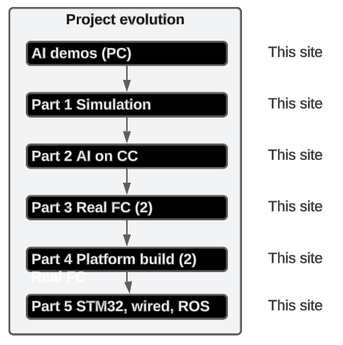
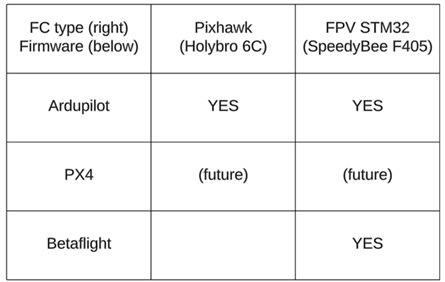

ZiptieAI is my intelligent AI drone project and the (important) documentation I created along the way. There are 4 main URLs:

- **[ziptieai.com](https://ziptieai.com)**. This website. Built with Jekyll on Github pages. 
- **[docs.ziptieai.com](https://docs.ziptieai.com)**. A very minimal documentation website (built with ReadTheDocs/Sphinx). The docs site basically mimics the structure and content of the wiki pages , but in an easier to read format. I will gradually fill this site with more detailed information gleaned from the docx’s (word files) on my Google drive.
- **[Wiki](https://github.com/terrytaylorbonn/auxdrone/wiki)**. The first place to look for udpated project info.
- **[Google drive](https://drive.google.com/drive/folders/1HrzLExPTAL5PIKx_j_y0GJ6_RANR8Tjm)**.  A lot of detailed .docx files (details are everything for this project). I am working alone without (human) assistance, so accurate, useful documentation is critical. 
  
#### **Why the name "ZiptieAI"?**

The original idea for the name came from the zipties the Ukrainian army uses for their very flexible and mission ready drones. 

But it also applies to my approach to building drones, as shown by my first FPV drone with a plywood frame that was flight tested on my kitchen work table. 

The second first flight was my x500 with PX4 on 24.0505. I spent a week trying get it flying with Ardupilot, but could not get the motors to spin (same problem with Ardupilot on the plywood drone; I have not figured out the problem yet). With PX4 it took one day. Nice.

#### **The evolution of the drone project**

I started this project in late 2023 with no assistance, some basic AI experience, and no experience with drones. The following summarizes the project steps:

My learning approach:
- Find anything that you can get working. Search everywhere (Youtube, Google, etc).  
- Get help from Youtube, Stack Overflow, and Google search (without these sources, it would be impossible to do this yourself). 
- Document as much as possible (on the **[Google drive docs](https://drive.google.com/drive/folders/1HrzLExPTAL5PIKx_j_y0GJ6_RANR8Tjm)**).
- Constantly update the plan and concepts (in the **[Wiki](https://github.com/terrytaylorbonn/auxdrone/wiki)**).

#### **Part 2: Types of AI apps / companion computers**

 **[Wiki part 2](https://github.com/terrytaylorbonn/auxdrone/wiki/Part-2-Real-AI-HW)**) focuses on AI on companion computers. This table (WIP) will summarize the AI app / CC combinations tested.

| CC | AI algorithm | Camera/driver |
|-------|--------|---------|
| Jetson Nano | xxx | xxx |
| PI4 | xxx | xxx |
| PI5 | xxx | xxx |

#### **Parts 3/4: Types of FC's / firmware**

The focus is currently on the 3 FC/firmware combinations shown below with "YES".

