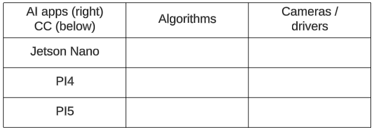

ZiptieAI is my intelligent AI drone project and (the very important) documentation I created along the way. There are 4 main URLs:

- **[ziptieai.com](https://ziptieai.com)**. This website. Built with Jekyll on Github pages. 
- **[docs.ziptieai.com](https://docs.ziptieai.com)**. A very minimal documentation website (built with ReadTheDocs/Sphinx). ZiptieAI is not a product, but rather shows how to use other products. Therefore there is little documentation about ZiptieAi itself.
- **[Wiki](https://github.com/terrytaylorbonn/auxdrone/wiki)**. The first place to look for udpated project info.
- **[Google drive](https://drive.google.com/drive/folders/1HrzLExPTAL5PIKx_j_y0GJ6_RANR8Tjm)**.  A lot of detailed .docx files (details are everything for this project). I am working alone without (human) assistance, so accurate, useful documentation is critical. 
  
#### **Why the name "ZiptieAI"?**

The original idea for the name came from the zipties the Ukrainian army uses for their very flexible and mission ready drones. 

But it also applies to my approach to building drone. You can see that in my first FPV drone (with a plywood frame) flight tested on my kitchen work table. 

#### **The evolution of the drone project**

I started this project in late 2023 with no assistance, basic AI experience, and no experience with drones. The following summarizes the project steps:

The following summarizes my learning approach:
- Find anything that you can get working. Search everywhere (Youtube, Google, etc).  
- Find bug help with Youtube, Stack Overflow, and Google search. 
- Document as much as possible (on the **[Google drive docs](https://drive.google.com/drive/folders/1HrzLExPTAL5PIKx_j_y0GJ6_RANR8Tjm)**).
- Constantly update the plan and concepts (in the **[Wiki](https://github.com/terrytaylorbonn/auxdrone/wiki)**).

#### **Part 2: Types of AI apps / companion computers**

Part 2 focuses on AI on companion computers. This table (WIP) will summarize the AI app / CC combinations tested.

#### **Parts 3/4: Types of FC's / firmware**

The focus is currently on the 3 FC/firmware combinations shown below with "YES".

