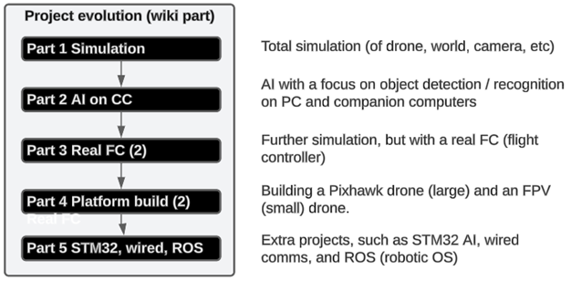
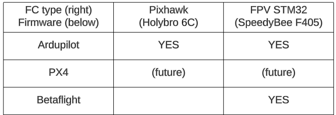

ZiptieAI is my intelligent AI drone project and (very importantly) the documentation I created along the way. There are 4 main URLs:

- **[Wiki](https://github.com/terrytaylorbonn/auxdrone/wiki)**. The first place to look for udpated project info.
- **[Google drive](https://drive.google.com/drive/folders/1HrzLExPTAL5PIKx_j_y0GJ6_RANR8Tjm)**.  A lot of detailed .docx files (details are everything for this project). I am working alone without (human) assistance, so accurate, useful documentation is critical. 
- **[ziptieai.com](https://ziptieai.com)**. This website. Built with Jekyll on Github pages. In the future, I will add a conceptual overview of the AI drone "assembly line".
- **[docs.ziptieai.com](https://docs.ziptieai.com)**. For now just a skeleton docs website (built with ReadTheDocs/Sphinx). 
  
#### **Why the name "ZiptieAI"?**

The original idea for the name came from the zipties the Ukrainian army uses for their very flexible and mission ready drones.  

 

But it also applies to my approach to building drone. You can see that in my first FPV drone, with a plywood frame. 

#### **The evolution of the drone project**

I started this project in late 2023 with no assistance and no previous experience with AI or drones. This is how it all eventually played out:

#### **Types of FC's / firmware covered**

The focus is currently on the 3 FC/firmware combinations shown below.

#### **The keys to success**

- Find anything that you can get working. Search everywhere (Youtube, Google, etc).  
- Find bug help with Youtube, Stack Overflow, and Google search. 
- Document as much as possible (for me thats mainly my **[Google drive docs](https://drive.google.com/drive/folders/1HrzLExPTAL5PIKx_j_y0GJ6_RANR8Tjm)**).
- Constantly update the plan and concepts (for me thats my **[Wiki](https://github.com/terrytaylorbonn/auxdrone/wiki)**).

*Last update 24.0502 (previous 24.0415)*