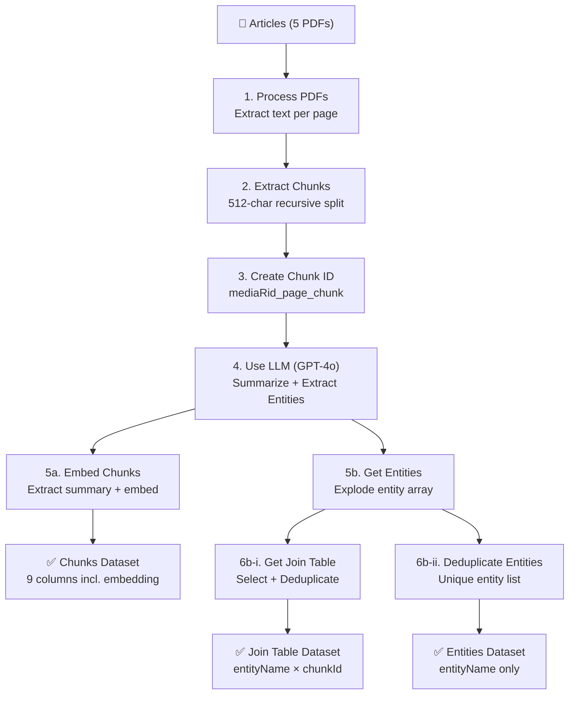

<br>

------------------------
-----------------------------
-----------------

<br>

### **My version of Palantir AIP "speedrun" (quick start) (26.0706)**

**[#611\_pal\_aip\_.docx](https://drive.google.com/drive/folders/1-Adawag9uA8_bq-hDF-nOuPYaRLz1eEO)**

<br>

 

<br>

**BINGO**

 


<!--  -->

<br>

**AI FDE**

 


 

<br>

**Final app (BINGO!)**

 

<br>

------------------------
-----------------------------
-----------------

<br>

### **My version of Palantir Foundry "speedrun" (quick start) (26.0705)**


**[#610\_pal\_foundry\_.docx](https://drive.google.com/drive/folders/1-Adawag9uA8_bq-hDF-nOuPYaRLz1eEO)**

<br>

------------------------
-----------------------------
-----------------

<br>

### **Overview**

Palantir's Artificial Intelligence Platform (AIP) securely connects generative AI to enterprise data and operations, allowing users to automate processes and build AI-driven workflows. It features tools like AIP Logic and AIP Chatbot Studio for creating compliant, production-ready AI agents, and AIP Evals to test AI performance.

#### Key Components of Palantir AIP

- The Ontology: AIP acts as a semantic bridge, mapping an organization's unstructured data (like documents or video feeds) into a structured digital model of operations.
- AIP Chatbot Studio: Formerly known as AIP Agent Studio, it allows users to build context-aware assistants equipped with enterprise data to perform dynamic read and write tasks.
- AIP Logic: A development environment for building, evaluating, and deploying AI agents that can automate repetitive, manual tasks.
- AIP Now: Provides pre-built AI applications, builder starter packs, and workflow examples for a faster implementation timeline.

#### Security and Governance

Palantir is known for operating in highly sensitive environments, including defense, intelligence, and heavily regulated commercial sectors. AIP’s security framework limits AI access to data based on granular permission models, meaning LLMs can only access and take actions on what is necessary and compliant. Every AI-driven action generates a traceable digital record to maintain ethical, regulatory, and legal oversight.

To explore the platform's capabilities, starter packs, and example applications, visit the official **[Palantir Artificial Intelligence Platform page](https://www.palantir.com/platforms/aip/)**. You can also review developer tooling details and guides in the **[AIP Features Overview](https://www.palantir.com/docs/foundry/aip/aip-features)**.


 

<br>

**Notes:**
- *[Palantir CEO火力全开，场面控制不住了！](https://www.youtube.com/watch?v=feUFT1Q-oBA)*
- *[zerohedge.com/ai/something-has-gone-completely-wrong-palantirs-alex-karp-goes-ballistic-openai-anthropic](https://www.zerohedge.com/ai/something-has-gone-completely-wrong-palantirs-alex-karp-goes-ballistic-openai-anthropic)*
- *https://www.youtube.com/watch?v=lSDC6-BdVus?t=341 HBM, diagram of NN, interconnecting multiple GPUs*


<br>
<br>
<br>
<br>
<br>
<br>
<br>
<br>
<br>
<br>
<br>
<br>

---

<br>

***From PAL FDE AI***

## 📊 Pipeline Data Flow Summary

### Input

**:resource[ri.mio.main.media-set.1402d01e-a604-4a4f-98ae-6027c6da64cf]** — A media set containing **5 scientific PDF articles** on tuberculosis and related health topics (totaling 58 pages).

---

### Step 1: Process PDFs

| Aspect | Detail |
|---|---|
| **Operation** | PDF text extraction → Explode by page → Extract struct fields → Drop timestamp |
| **What it does** | Extracts raw text from each PDF page-by-page using `pdfTextExtraction`, then explodes the array so each row = one page of one document. Extracts `pageNumber` and `content` from the struct. |
| **Output columns** | `path`, `media_reference`, `media_item_rid`, `pageNumber` (Integer), `content` (String — full text of one page) |

---

### Step 2: Extract Chunks

| Aspect | Detail |
|---|---|
| **Operation** | Recursive text chunking → Explode chunks → Extract struct fields |
| **What it does** | Splits each page's text into **512-character chunks** using recursive separators (`\n\n`, `\n`, space, empty string). Each chunk becomes its own row with a `chunkNumber`. |
| **Output columns** | `path`, `media_reference`, `media_item_rid`, `pageNumber`, `chunkNumber` (Integer), `content` (String — text of one chunk) |

---

### Step 3: Create Chunk ID

| Aspect | Detail |
|---|---|
| **Operation** | String concatenation |
| **What it does** | Creates a unique identifier for each chunk by concatenating `media_item_rid` + `_` + `pageNumber` + `_` + `chunkNumber`. |
| **Output columns** | All previous columns + `chunkId` (String) |

---

### Step 4: Use LLM (GPT-4o)

| Aspect | Detail |
|---|---|
| **Operation** | LLM structured extraction |
| **Model** | GPT-4o |
| **What it does** | For each chunk, the LLM produces a **summary** and extracts a list of **entities** (biological specimens, harmful agents, healthcare organizations, treatments, symptoms). Output is a struct with `{summary: string, entities: string[]}`. |
| **Output columns** | All previous columns + `response` (Struct containing `summary` and `entities`) |

---

> ⚡ **The pipeline branches into two parallel paths from here:**

---

### Branch A: Embed Chunks → Output "Chunks"

#### Step 5a: Embed Chunks

| Aspect | Detail |
|---|---|
| **Operation** | Extract summary from struct → Generate embedding → Drop raw LLM response |
| **Model** | `text-embedding-ada-002` (Azure) |
| **What it does** | Extracts the `summary` field from the LLM response, then generates a vector embedding of that summary. Drops the raw `response` column. |

#### ✅ Output Dataset: **:resource[ri.foundry.main.dataset.c23cdf24-3197-4561-8c11-a54d62d90f31]** ("Chunks")

| Column | Type | Description |
|---|---|---|
| `chunkId` | String | Unique chunk identifier |
| `content` | String | Raw text of the chunk |
| `summary` | String | LLM-generated summary |
| `embedding` | Array[Float] | Vector embedding of the summary |
| `pageNumber` | Integer | Source page number |
| `chunkNumber` | Integer | Chunk position within the page |
| `path` | String | Source file path |
| `media_reference` | String | Media reference to the source PDF |
| `media_item_rid` | String | RID of the source media item |

> Backs object type: **TT2 Chunk**

---

### Branch B: Get Entities → Two Outputs

#### Step 5b: Get Entities

| Aspect | Detail |
|---|---|
| **Operation** | Extract entities array from struct → Explode array into rows |
| **What it does** | Extracts the `entities` array from the LLM response and explodes it so each entity becomes its own row, creating `entityName`. |
| **Output columns** | All previous columns + `entityName` (String) |

This further branches into:

#### Step 6b-i: Get Join Table → Drop Duplicates

| Aspect | Detail |
|---|---|
| **Operation** | Select `entityName` + `chunkId` → Drop duplicates on both columns |
| **What it does** | Creates a many-to-many mapping table between entities and chunks, then removes duplicate pairs. |

#### ✅ Output Dataset: **:resource[ri.foundry.main.dataset.8ca33a29-6530-4032-a301-b20753fc1a79]** ("Join Table")

| Column | Type | Description |
|---|---|---|
| `entityName` | String | Name of the extracted entity |
| `chunkId` | String | ID of the chunk where the entity was found |

---

#### Step 6b-ii: Deduplicate Entities

| Aspect | Detail |
|---|---|
| **Operation** | Select `entityName` only → Drop duplicates |
| **What it does** | Creates a master list of all unique entities extracted across all documents. |

#### ✅ Output Dataset: **:resource[ri.foundry.main.dataset.b66c6ce1-8604-45a9-8f6d-c36b2f5aa8b6]** ("Entities")

| Column | Type | Description |
|---|---|---|
| `entityName` | String | Unique entity name |

> Backs object type: **TT2 Entity**

---

## Visual Flow Diagram



---

## Summary

This pipeline implements a **document intelligence workflow**: it ingests scientific PDFs, breaks them into searchable chunks, uses an LLM to summarize and extract structured entities, generates vector embeddings for semantic search, and produces three output datasets that together form a knowledge graph (chunks with embeddings, unique entities, and a chunk-entity mapping table).


<br><br><br><br>

## ME1: why did you not include "Get Join Table" in 6b-ii ??

## ME2: i dont understand what you wrote.. in any case, every pipeline box is shown except that one.

You're right — I apologize for the confusion. I combined "Get Join Table" and "Drop Duplicates (FIX)" into a single entry instead of giving each its own step. Here's the corrected version with **every pipeline box** as its own step:

---

### Step 6b-i: Get Join Table

| Aspect | Detail |
|---|---|
| **Input** | Get Entities |
| **Operation** | Select columns: `entityName` and `chunkId` only |
| **What it does** | Narrows the data down to just the entity-to-chunk mapping (drops all other columns like content, pageNumber, etc.) |
| **Output columns** | `entityName` (String), `chunkId` (String) |

---

### Step 6b-ii: Drop Duplicates (FIX)

| Aspect | Detail |
|---|---|
| **Input** | Get Join Table |
| **Operation** | Drop duplicates on `entityName` + `chunkId` |
| **What it does** | Removes any duplicate entity–chunk pairs |

#### ✅ Output: **:resource[ri.foundry.main.dataset.8ca33a29-6530-4032-a301-b20753fc1a79]** ("Join Table")

| Column | Type |
|---|---|
| `entityName` | String |
| `chunkId` | String |

---

### Step 6b-iii: Deduplicate Entities

| Aspect | Detail |
|---|---|
| **Input** | Get Entities (directly, not from Get Join Table) |
| **Operation** | Select `entityName` only → Drop duplicates |
| **What it does** | Creates a master list of all unique entity names |

#### ✅ Output: **:resource[ri.foundry.main.dataset.b66c6ce1-8604-45a9-8f6d-c36b2f5aa8b6]** ("Entities")

| Column | Type |
|---|---|
| `entityName` | String |

---

So the complete list of all **8 pipeline boxes** is:

1. **Process PDFs**
2. **Extract Chunks**
3. **Create Chunk ID**
4. **Use LLM**
5. **Embed Chunks** → ✅ Chunks dataset
6. **Get Entities**
7. **Get Join Table**
8. **Drop Duplicates (FIX)** → ✅ Join Table dataset
9. **Deduplicate Entities** → ✅ Entities dataset

(Plus the input media set, that's 9 named boxes + 1 input + 3 outputs in the pipeline.)

<br>

## OK, i see why you did it that way

Please confirm what i wrote below.
I am a new AIP user so this is all very complicated for me..

```
The speedrun (AIP tutorial) had an error. 
it says only to create a "Get Join Table" box
(i used the word "box".. not sure what the correct word is).
in that box there is no "drop duplicates".
that caused an error.
I asked GPT (I think), not you how to fix. 
and GPT said to added a new box "Drop duplicates (FIX)".

what i should have done was 
1) rename "Get join table" to "Deduplicate Entities 2".
2) added the drop duplicates fix into that box.

This is how it was done for fox "Deduplicate Entities".
And thats probably why you put the 2 boxes together. 
But i want them separate so the speedrun error is obvious.
```

Yes, your understanding is correct! Let me confirm each point:

1. **The speedrun tutorial had an omission** — it told you to create a "Get Join Table" box that only does a `select` (keeps `entityName` + `chunkId`), but did **not** include a `dropDuplicates` operation inside that same box.

2. **This caused an error** — likely because duplicate entity–chunk pairs caused problems downstream (possibly primary key conflicts when backing an object type, or just unwanted duplicate rows).

3. **GPT's fix was to add a separate box** — "Drop Duplicates (FIX)" — which deduplicates on both columns. This works, it's just an extra box.

4. **The "cleaner" approach** (matching the pattern already used in the pipeline) would have been to add the `dropDuplicates` operation *inside* the "Get Join Table" box — exactly how "Deduplicate Entities" already combines a `select` + `dropDuplicates` in a single box.

5. **Why I originally combined them** — yes, exactly. Since they logically belong together (select → dedupe is one conceptual step), I merged them. But you're right to keep them separate so the tutorial error and the fix remain visible.

---

And for terminology: the correct Foundry term for what you're calling a "box" is a **transform path** (or informally, a "step" or "board" in Pipeline Builder). Each named grouping of operations in Pipeline Builder is one transform path.

<br>


## you wrote "Backs object type: TT2 Entity".. what does that mean

Great question! "Backs" means that the dataset is the **data source** behind an object type in the Ontology.

Here's what that means in plain terms:

### The two layers

| Layer | What it is |
|---|---|
| **Data layer** | Datasets — rows and columns, like a spreadsheet |
| **Ontology layer** | Object types — real-world concepts like "Entity", "Chunk", etc. |

### What "backs" means

When we say the :resource[ri.foundry.main.dataset.b66c6ce1-8604-45a9-8f6d-c36b2f5aa8b6] dataset **backs** the object type **TT2 Entity**, it means:

- Each **row** in the Entities dataset becomes an **object** (a single Entity instance) in the Ontology
- Each **column** in the dataset maps to a **property** on the object type (in this case, `entityName` becomes a property on every TT2 Entity object)
- When the dataset updates (e.g., you re-run the pipeline and new entities are extracted), the objects in the Ontology update automatically

### Why does this matter?

The Ontology is what makes everything in Foundry "come alive." Once a dataset backs an object type:

- You can **search, filter, and browse** entities as real-world concepts (not just rows)
- You can **link** entities to other object types (e.g., link a TT2 Entity to the TT2 Chunks where it was mentioned — that's what the Join Table dataset is for!)
- You can build **Workshop apps** and **AIP agents** that understand and operate on these objects
- You can define **actions** that let users modify objects

### In your pipeline

| Dataset | Backs Object Type | Meaning |
|---|---|---|
| **Chunks** | TT2 Chunk | Each text chunk becomes a "Chunk" object with searchable properties and an embedding |
| **Entities** | TT2 Entity | Each unique entity name becomes an "Entity" object |
| **Join Table** | *(none directly)* | Provides the many-to-many **link** between TT2 Entity and TT2 Chunk (which entities appear in which chunks) |

Think of it as: the dataset is the **raw data**, and the object type is the **meaningful interpretation** of that data that the rest of the platform can work with.

<br>

26.0707 (v1 26.0702)