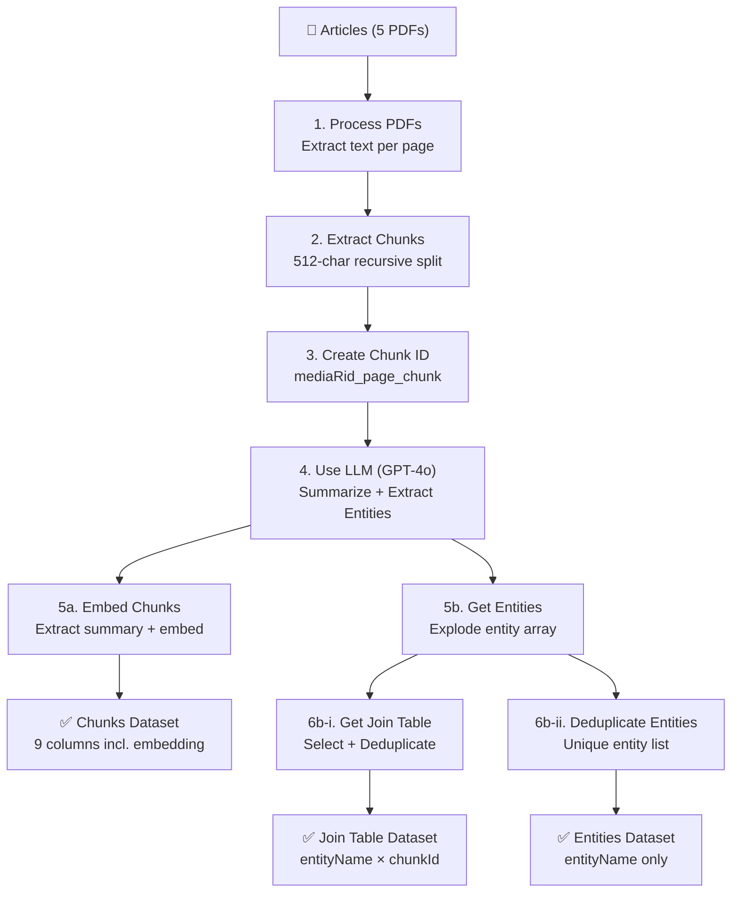

 

------------------------
-----------------------------
-----------------

 

### **My version of Palantir AIP "speedrun" (quick start) (26.0706)**

**[#611\_pal\_aip\_.docx](https://drive.google.com/drive/folders/1-Adawag9uA8_bq-hDF-nOuPYaRLz1eEO)**

 

 

 

**BINGO**

 

<!--  -->

 

**AI FDE**

 

 

 

**Final app (BINGO!)**

 

 

------------------------
-----------------------------
-----------------

 

### **My version of Palantir Foundry "speedrun" (quick start) (26.0705)**

**[#610\_pal\_foundry\_.docx](https://drive.google.com/drive/folders/1-Adawag9uA8_bq-hDF-nOuPYaRLz1eEO)**

 

------------------------
-----------------------------
-----------------

 

### **Overview**

Palantir's Artificial Intelligence Platform (AIP) securely connects generative AI to enterprise data and operations, allowing users to automate processes and build AI-driven workflows. It features tools like AIP Logic and AIP Chatbot Studio for creating compliant, production-ready AI agents, and AIP Evals to test AI performance.

#### Key Components of Palantir AIP

- The Ontology: AIP acts as a semantic bridge, mapping an organization's unstructured data (like documents or video feeds) into a structured digital model of operations.
- AIP Chatbot Studio: Formerly known as AIP Agent Studio, it allows users to build context-aware assistants equipped with enterprise data to perform dynamic read and write tasks.
- AIP Logic: A development environment for building, evaluating, and deploying AI agents that can automate repetitive, manual tasks.
- AIP Now: Provides pre-built AI applications, builder starter packs, and workflow examples for a faster implementation timeline.

#### Security and Governance

Palantir is known for operating in highly sensitive environments, including defense, intelligence, and heavily regulated commercial sectors. AIP’s security framework limits AI access to data based on granular permission models, meaning LLMs can only access and take actions on what is necessary and compliant. Every AI-driven action generates a traceable digital record to maintain ethical, regulatory, and legal oversight.

To explore the platform's capabilities, starter packs, and example applications, visit the official **[Palantir Artificial Intelligence Platform page](https://www.palantir.com/platforms/aip/)**. You can also review developer tooling details and guides in the **[AIP Features Overview](https://www.palantir.com/docs/foundry/aip/aip-features)**.

 

 

**Notes:**
- *[Palantir CEO火力全开，场面控制不住了！](https://www.youtube.com/watch?v=feUFT1Q-oBA)*
- *[zerohedge.com/ai/something-has-gone-completely-wrong-palantirs-alex-karp-goes-ballistic-openai-anthropic](https://www.zerohedge.com/ai/something-has-gone-completely-wrong-palantirs-alex-karp-goes-ballistic-openai-anthropic)*
- *https://www.youtube.com/watch?v=lSDC6-BdVus?t=341 HBM, diagram of NN, interconnecting multiple GPUs*

 
 
 
 
 
 
 
 
 
 
 
 

---

 

***From PAL FDE AI***

## 📊 Pipeline Data Flow Summary

### Input

**:resource[ri.mio.main.media-set.1402d01e-a604-4a4f-98ae-6027c6da64cf]** — A media set containing **5 scientific PDF articles** on tuberculosis and related health topics (totaling 58 pages).

---

### Step 1: Process PDFs

| Aspect | Detail |
|---|---|
| **Operation** | PDF text extraction → Explode by page → Extract struct fields → Drop timestamp |
| **What it does** | Extracts raw text from each PDF page-by-page using `pdfTextExtraction`, then explodes the array so each row = one page of one document. Extracts `pageNumber` and `content` from the struct. |
| **Output columns** | `path`, `media_reference`, `media_item_rid`, `pageNumber` (Integer), `content` (String — full text of one page) |

---

### Step 2: Extract Chunks

| Aspect | Detail |
|---|---|
| **Operation** | Recursive text chunking → Explode chunks → Extract struct fields |
| **What it does** | Splits each page's text into **512-character chunks** using recursive separators (`\n\n`, `\n`, space, empty string). Each chunk becomes its own row with a `chunkNumber`. |
| **Output columns** | `path`, `media_reference`, `media_item_rid`, `pageNumber`, `chunkNumber` (Integer), `content` (String — text of one chunk) |

---

### Step 3: Create Chunk ID

| Aspect | Detail |
|---|---|
| **Operation** | String concatenation |
| **What it does** | Creates a unique identifier for each chunk by concatenating `media_item_rid` + `_` + `pageNumber` + `_` + `chunkNumber`. |
| **Output columns** | All previous columns + `chunkId` (String) |

---

### Step 4: Use LLM (GPT-4o)

| Aspect | Detail |
|---|---|
| **Operation** | LLM structured extraction |
| **Model** | GPT-4o |
| **What it does** | For each chunk, the LLM produces a **summary** and extracts a list of **entities** (biological specimens, harmful agents, healthcare organizations, treatments, symptoms). Output is a struct with `{summary: string, entities: string[]}`. |
| **Output columns** | All previous columns + `response` (Struct containing `summary` and `entities`) |

---

> ⚡ **The pipeline branches into two parallel paths from here:**

---

### Branch A: Embed Chunks → Output "Chunks"

#### Step 5a: Embed Chunks

| Aspect | Detail |
|---|---|
| **Operation** | Extract summary from struct → Generate embedding → Drop raw LLM response |
| **Model** | `text-embedding-ada-002` (Azure) |
| **What it does** | Extracts the `summary` field from the LLM response, then generates a vector embedding of that summary. Drops the raw `response` column. |

#### ✅ Output Dataset: **:resource[ri.foundry.main.dataset.c23cdf24-3197-4561-8c11-a54d62d90f31]** ("Chunks")

| Column | Type | Description |
|---|---|---|
| `chunkId` | String | Unique chunk identifier |
| `content` | String | Raw text of the chunk |
| `summary` | String | LLM-generated summary |
| `embedding` | Array[Float] | Vector embedding of the summary |
| `pageNumber` | Integer | Source page number |
| `chunkNumber` | Integer | Chunk position within the page |
| `path` | String | Source file path |
| `media_reference` | String | Media reference to the source PDF |
| `media_item_rid` | String | RID of the source media item |

> Backs object type: **TT2 Chunk**

---

### Branch B: Get Entities → Two Outputs

#### Step 5b: Get Entities

| Aspect | Detail |
|---|---|
| **Operation** | Extract entities array from struct → Explode array into rows |
| **What it does** | Extracts the `entities` array from the LLM response and explodes it so each entity becomes its own row, creating `entityName`. |
| **Output columns** | All previous columns + `entityName` (String) |

This further branches into:

#### Step 6b-i: Get Join Table → Drop Duplicates

| Aspect | Detail |
|---|---|
| **Operation** | Select `entityName` + `chunkId` → Drop duplicates on both columns |
| **What it does** | Creates a many-to-many mapping table between entities and chunks, then removes duplicate pairs. |

#### ✅ Output Dataset: **:resource[ri.foundry.main.dataset.8ca33a29-6530-4032-a301-b20753fc1a79]** ("Join Table")

| Column | Type | Description |
|---|---|---|
| `entityName` | String | Name of the extracted entity |
| `chunkId` | String | ID of the chunk where the entity was found |

---

#### Step 6b-ii: Deduplicate Entities

| Aspect | Detail |
|---|---|
| **Operation** | Select `entityName` only → Drop duplicates |
| **What it does** | Creates a master list of all unique entities extracted across all documents. |

#### ✅ Output Dataset: **:resource[ri.foundry.main.dataset.b66c6ce1-8604-45a9-8f6d-c36b2f5aa8b6]** ("Entities")

| Column | Type | Description |
|---|---|---|
| `entityName` | String | Unique entity name |

> Backs object type: **TT2 Entity**

---

## Visual Flow Diagram

---

## Summary

This pipeline implements a **document intelligence workflow**: it ingests scientific PDFs, breaks them into searchable chunks, uses an LLM to summarize and extract structured entities, generates vector embeddings for semantic search, and produces three output datasets that together form a knowledge graph (chunks with embeddings, unique entities, and a chunk-entity mapping table).

 

26.0707 (v1 26.0702)